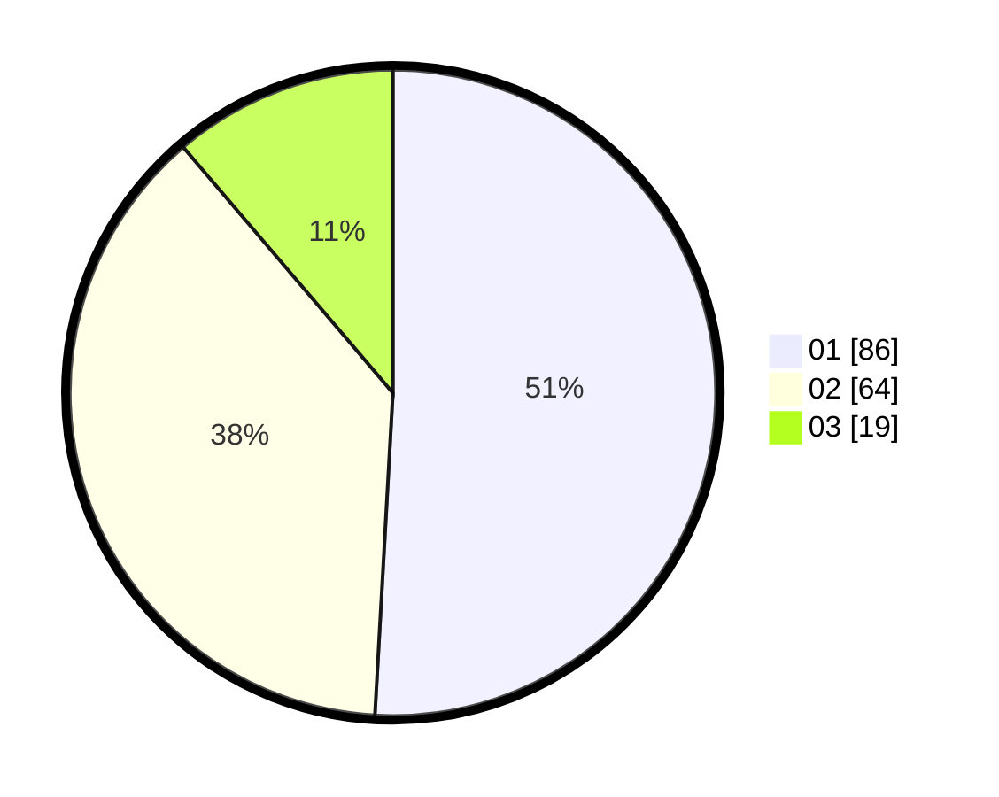

# Hasil

Hasil perolehan suara paslon dapat dilihat pada file paslon-01.txt, paslon-02.txt, dan paslon-03.txt.

Jika tidak ada, artinya data tersebut belum ada pada SIREKAP.

## Perolehan Suara

 * Paslon 01: **86**.
 * Paslon 02: **64**.
 * Paslon 03: **19**.

## Foto C Plano

https://sirekap-obj-formc.kpu.go.id/0e54/pemilu/ppwp/31/73/08/10/03/3173081003097-20240214-203832--81fc3a2e-edaf-407e-a838-8fb29afa9d4b.jpg

https://sirekap-obj-formc.kpu.go.id/0e54/pemilu/ppwp/31/73/08/10/03/3173081003097-20240214-203935--1a6f9b37-b374-43e4-bd8a-c298f25547fd.jpg

https://sirekap-obj-formc.kpu.go.id/0e54/pemilu/ppwp/31/73/08/10/03/3173081003097-20240214-204024--1cf77e8a-d2fa-49bb-a0f1-3665021a6dcc.jpg
