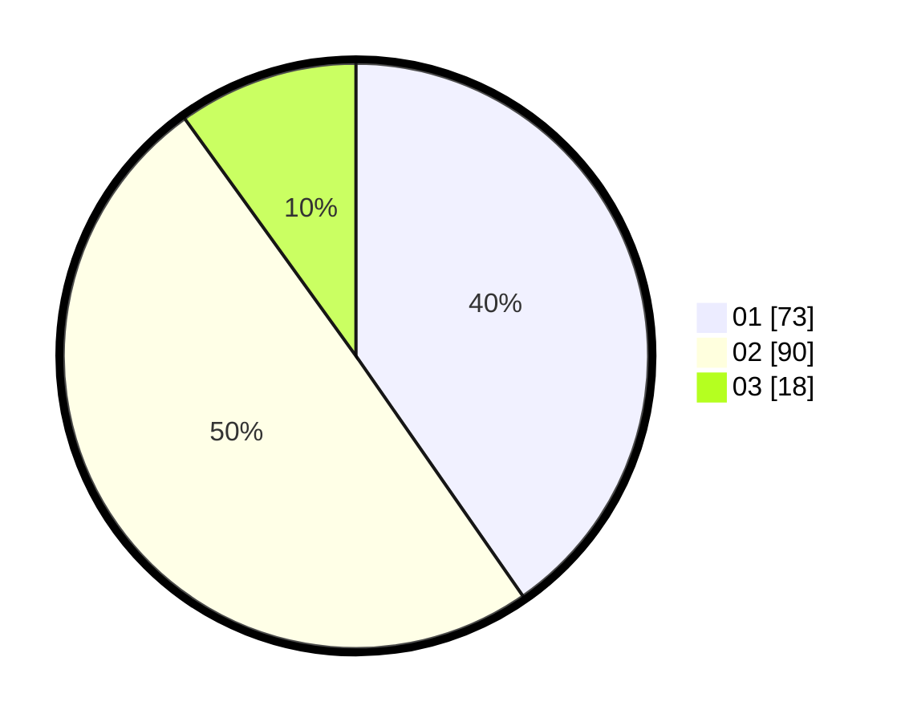

# Hasil

Hasil perolehan suara paslon dapat dilihat pada file paslon-01.txt, paslon-02.txt, dan paslon-03.txt.

Jika tidak ada, artinya data tersebut belum ada pada SIREKAP.

## Perolehan Suara

 * Paslon 01: **73**.
 * Paslon 02: **90**.
 * Paslon 03: **18**.

## Foto C Plano

https://sirekap-obj-formc.kpu.go.id/ee48/pemilu/ppwp/31/73/08/10/03/3173081003100-20240214-193042--2c032e4d-dd9e-4e55-b3e2-1c0a46e04c5b.jpg

https://sirekap-obj-formc.kpu.go.id/ee48/pemilu/ppwp/31/73/08/10/03/3173081003100-20240214-193056--4eafca06-94ac-4049-97bc-111ff52d1a4a.jpg

https://sirekap-obj-formc.kpu.go.id/ee48/pemilu/ppwp/31/73/08/10/03/3173081003100-20240214-193111--e82bf4f4-92c4-4b05-872f-e587cf709ef9.jpg
