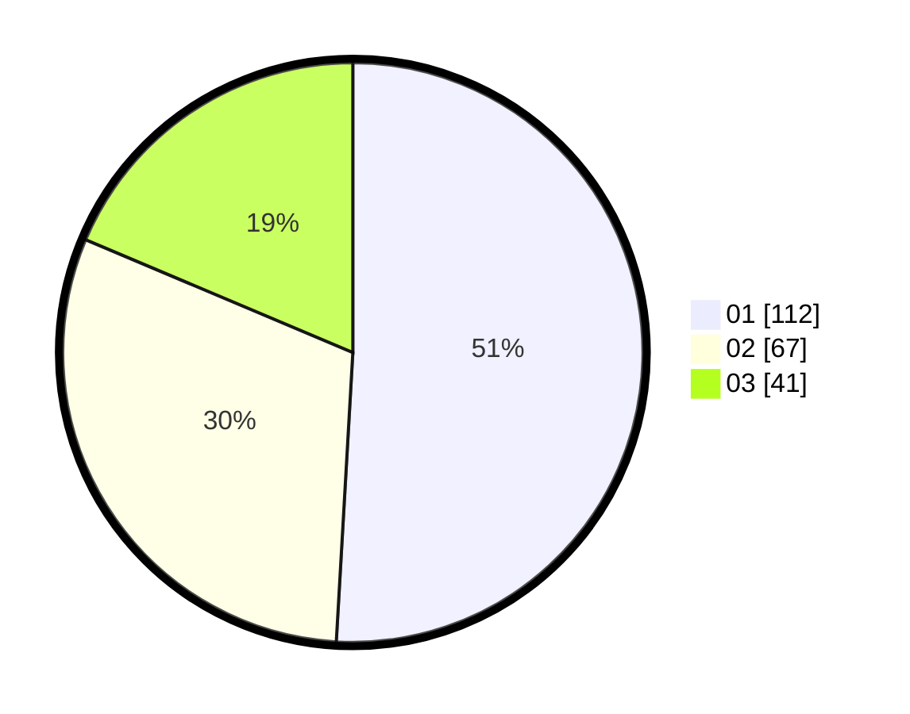

# Hasil

Hasil perolehan suara paslon dapat dilihat pada file paslon-01.txt, paslon-02.txt, dan paslon-03.txt.

Jika tidak ada, artinya data tersebut belum ada pada SIREKAP.

## Perolehan Suara

 * Paslon 01: **112**.
 * Paslon 02: **67**.
 * Paslon 03: **41**.

## Foto C Plano

https://sirekap-obj-formc.kpu.go.id/30a0/pemilu/ppwp/31/73/08/10/03/3173081003103-20240215-150809--5e794c0c-f5ab-45ff-941f-f2ff801fac45.jpg

https://sirekap-obj-formc.kpu.go.id/30a0/pemilu/ppwp/31/73/08/10/03/3173081003103-20240215-150811--22d91013-e37d-4899-a764-c136ded6423a.jpg

https://sirekap-obj-formc.kpu.go.id/30a0/pemilu/ppwp/31/73/08/10/03/3173081003103-20240215-150813--d863438b-959a-44e7-944d-4d5d162871c1.jpg
