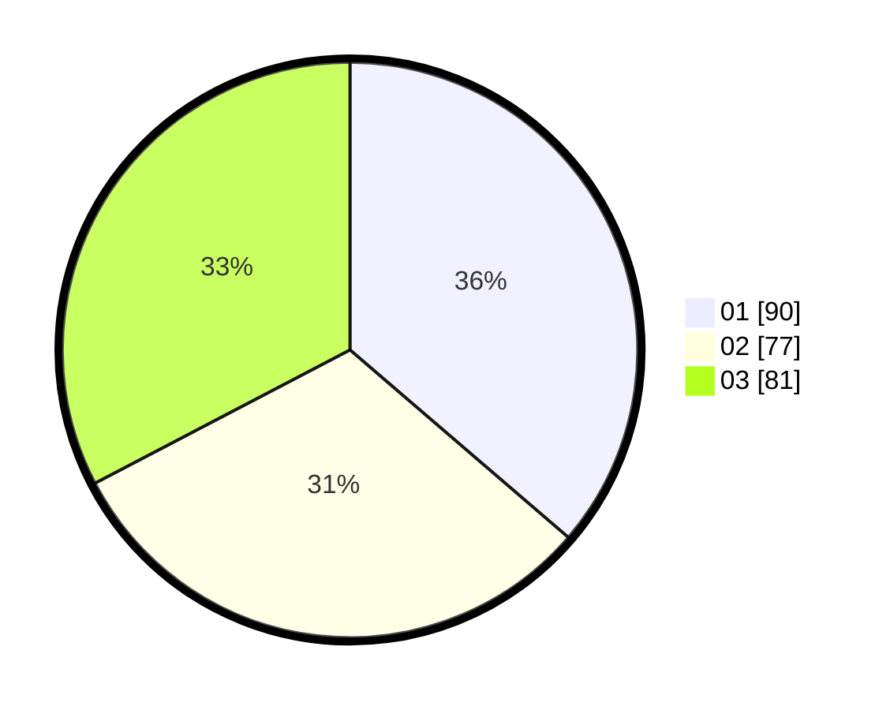

# Hasil

Hasil perolehan suara paslon dapat dilihat pada file paslon-01.txt, paslon-02.txt, dan paslon-03.txt.

Jika tidak ada, artinya data tersebut belum ada pada SIREKAP.

## Perolehan Suara

 * Paslon 01: **90**.
 * Paslon 02: **77**.
 * Paslon 03: **81**.

## Foto C Plano

https://sirekap-obj-formc.kpu.go.id/84b3/pemilu/ppwp/31/73/08/10/03/3173081003105-20240214-204352--a536740e-2ccb-4126-9cd6-9d6893e7a192.jpg

https://sirekap-obj-formc.kpu.go.id/84b3/pemilu/ppwp/31/73/08/10/03/3173081003105-20240214-204410--5dfddc7f-6773-407e-b702-c649dbefd1db.jpg

https://sirekap-obj-formc.kpu.go.id/84b3/pemilu/ppwp/31/73/08/10/03/3173081003105-20240214-204427--a5919d30-3d30-43ba-b7cd-e87b3141a187.jpg
