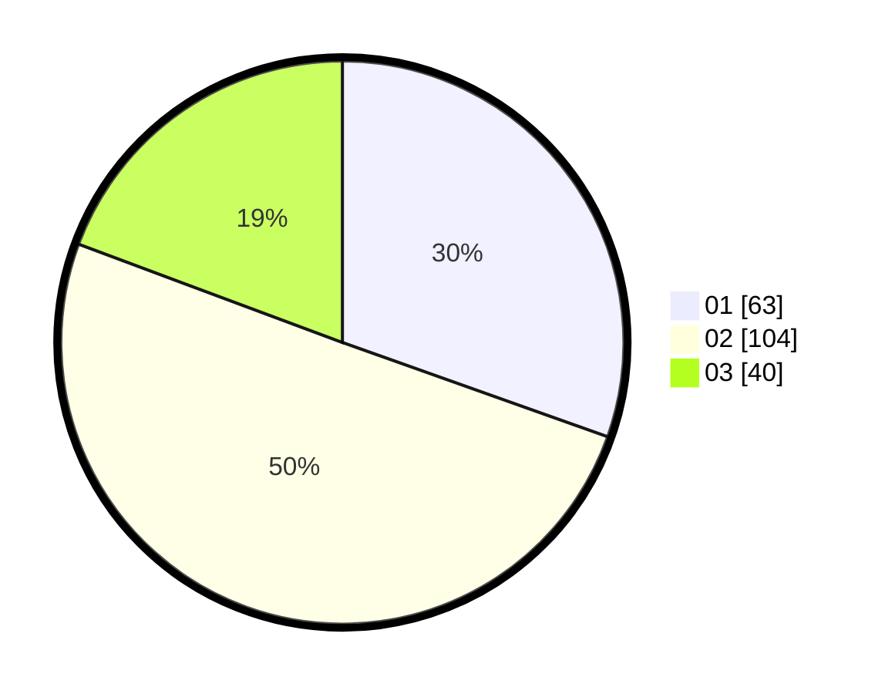

# Hasil

Hasil perolehan suara paslon dapat dilihat pada file paslon-01.txt, paslon-02.txt, dan paslon-03.txt.

Jika tidak ada, artinya data tersebut belum ada pada SIREKAP.

## Perolehan Suara

 * Paslon 01: **63**.
 * Paslon 02: **104**.
 * Paslon 03: **40**.

## Foto C Plano

https://sirekap-obj-formc.kpu.go.id/3d89/pemilu/ppwp/31/73/08/10/03/3173081003106-20240215-021423--fd230c9f-e22b-430c-8971-3d1afe1abd10.jpg

https://sirekap-obj-formc.kpu.go.id/3d89/pemilu/ppwp/31/73/08/10/03/3173081003106-20240214-215527--95a35151-3b8b-4550-94ee-40825b086490.jpg

https://sirekap-obj-formc.kpu.go.id/3d89/pemilu/ppwp/31/73/08/10/03/3173081003106-20240214-215931--a29be73c-643c-45f6-891d-cadc87ea316e.jpg
