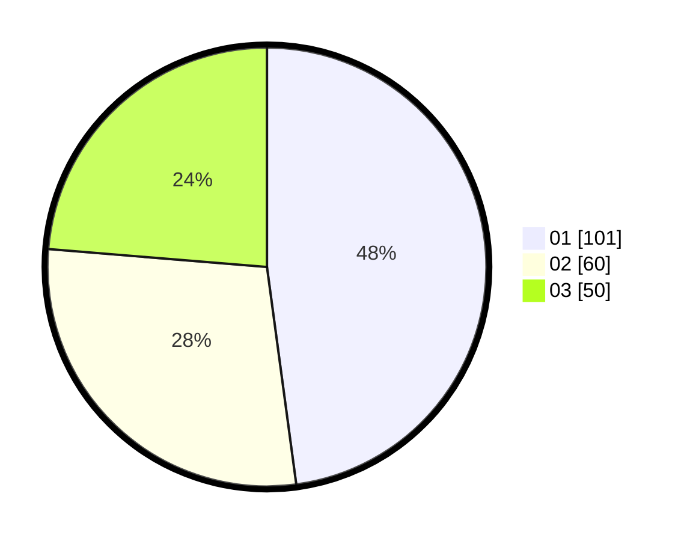

# Hasil

Hasil perolehan suara paslon dapat dilihat pada file paslon-01.txt, paslon-02.txt, dan paslon-03.txt.

Jika tidak ada, artinya data tersebut belum ada pada SIREKAP.

## Perolehan Suara

 * Paslon 01: **101**.
 * Paslon 02: **60**.
 * Paslon 03: **50**.

## Foto C Plano

https://sirekap-obj-formc.kpu.go.id/1381/pemilu/ppwp/31/73/08/10/03/3173081003107-20240214-223903--4b91dda8-b92c-41be-9287-7c04aed62d28.jpg

https://sirekap-obj-formc.kpu.go.id/1381/pemilu/ppwp/31/73/08/10/03/3173081003107-20240214-223215--8208e825-232f-4eaa-af22-828abbf42a4b.jpg

https://sirekap-obj-formc.kpu.go.id/1381/pemilu/ppwp/31/73/08/10/03/3173081003107-20240214-223258--d624afff-5129-406c-8a54-e550340a9252.jpg

## DATA PEMILIH TETAP

Jumlah pemilih dalam DPT: **273**.
 * L: **133**.
 * P: **140**.

## DATA PENGGUNA HAK PILIH

Jumlah pengguna hak pilih dalam DPT: **217**.
 * L: **103**.
 * P: **114**.

Jumlah pengguna hak pilih dalam DPTb: **4**.
 * L: **1**.
 * P: **3**.

Jumlah pengguna hak pilih dalam DPK: **0**.
 * L: **0**.
 * P: **0**.

Jumlah pengguna hak pilih: **221**.
 * L: **104**.
 * P: **117**.

## JUMLAH SUARA SAH DAN TIDAK SAH

JUMLAH SELURUH SUARA SAH: **219**.

JUMLAH SUARA TIDAK SAH: **2**.

JUMLAH SELURUH SUARA SAH DAN SUARA TIDAK SAH: **221**.
