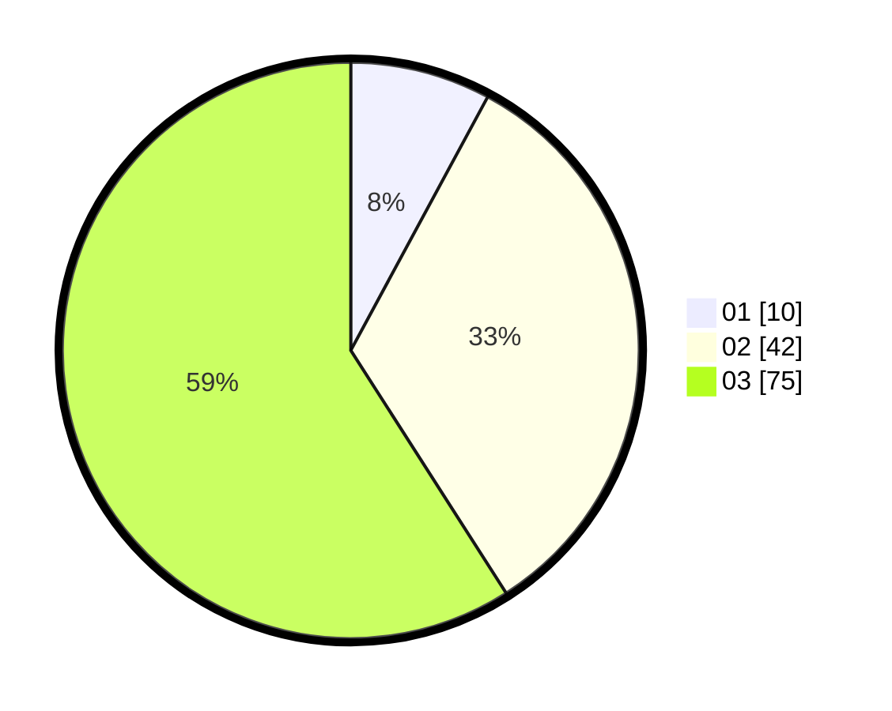

# Hasil

Hasil perolehan suara paslon dapat dilihat pada file paslon-01.txt, paslon-02.txt, dan paslon-03.txt.

Jika tidak ada, artinya data tersebut belum ada pada SIREKAP.

## Perolehan Suara

 * Paslon 01: **10**.
 * Paslon 02: **42**.
 * Paslon 03: **75**.

## Foto C Plano

https://sirekap-obj-formc.kpu.go.id/3cba/pemilu/ppwp/31/73/08/10/03/3173081003112-20240214-191356--531bb141-f242-4d5b-b6ed-6d1d9d7e2801.jpg

https://sirekap-obj-formc.kpu.go.id/3cba/pemilu/ppwp/31/73/08/10/03/3173081003112-20240214-192327--e535d5d2-7561-412c-bfb1-cfae7f4347f0.jpg

https://sirekap-obj-formc.kpu.go.id/3cba/pemilu/ppwp/31/73/08/10/03/3173081003112-20240214-192055--8fc60508-1f9d-477d-bfe2-985c193f84a8.jpg
