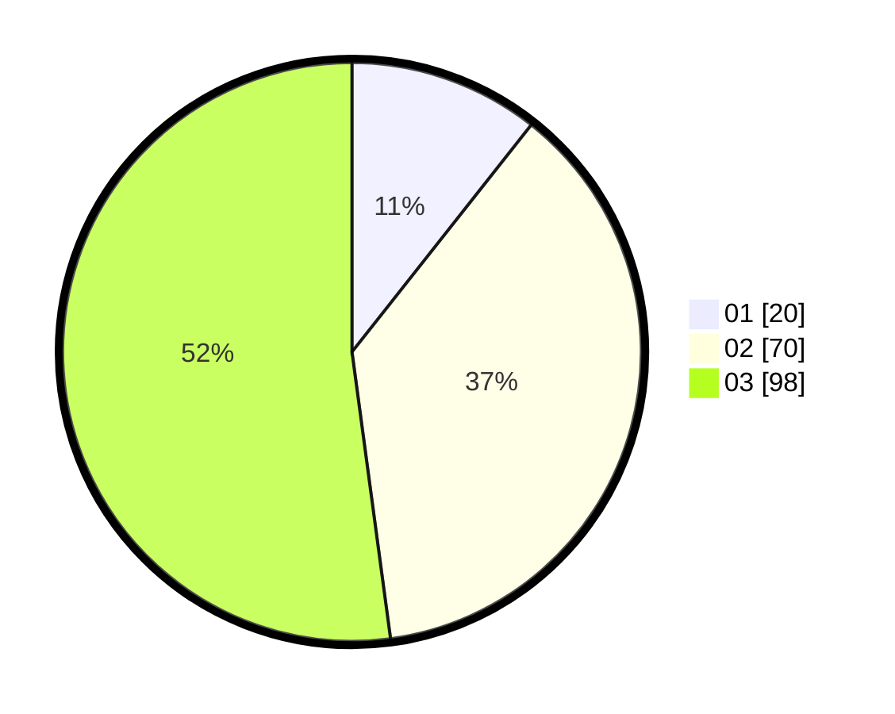

# Hasil

Hasil perolehan suara paslon dapat dilihat pada file paslon-01.txt, paslon-02.txt, dan paslon-03.txt.

Jika tidak ada, artinya data tersebut belum ada pada SIREKAP.

## Perolehan Suara

 * Paslon 01: **20**.
 * Paslon 02: **70**.
 * Paslon 03: **98**.

## Foto C Plano

https://sirekap-obj-formc.kpu.go.id/5594/pemilu/ppwp/31/73/08/10/03/3173081003114-20240214-204538--47e6138f-d3f9-4956-ba51-7f4677e6b77e.jpg

https://sirekap-obj-formc.kpu.go.id/5594/pemilu/ppwp/31/73/08/10/03/3173081003114-20240214-201324--a3f042d2-5e9f-4db1-b03a-7ca035834f4b.jpg
