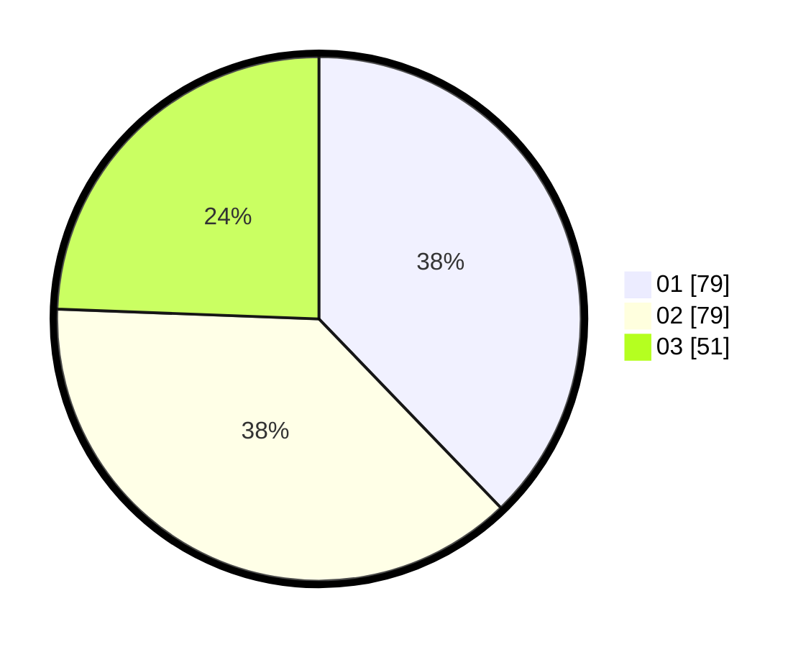

# Hasil

Hasil perolehan suara paslon dapat dilihat pada file paslon-01.txt, paslon-02.txt, dan paslon-03.txt.

Jika tidak ada, artinya data tersebut belum ada pada SIREKAP.

## Perolehan Suara

 * Paslon 01: **79**.
 * Paslon 02: **79**.
 * Paslon 03: **51**.

## Foto C Plano

https://sirekap-obj-formc.kpu.go.id/95ab/pemilu/ppwp/31/73/08/10/04/3173081004008-20240217-223905--c901e08c-2533-4da9-9757-68c8f1835efb.jpg

https://sirekap-obj-formc.kpu.go.id/95ab/pemilu/ppwp/31/73/08/10/04/3173081004008-20240217-225001--e0670b72-3ba7-4863-a631-88a8cd64f22a.jpg

https://sirekap-obj-formc.kpu.go.id/95ab/pemilu/ppwp/31/73/08/10/04/3173081004008-20240217-224729--bd8f21eb-964b-4f42-9604-15d599b0dc00.jpg

## DATA PEMILIH TETAP

Jumlah pemilih dalam DPT: **290**.
 * L: **143**.
 * P: **147**.

## DATA PENGGUNA HAK PILIH

Jumlah pengguna hak pilih dalam DPT: **200**.
 * L: **91**.
 * P: **109**.

Jumlah pengguna hak pilih dalam DPTb: **11**.
 * L: **4**.
 * P: **7**.

Jumlah pengguna hak pilih dalam DPK: **0**.
 * L: **0**.
 * P: **0**.

Jumlah pengguna hak pilih: **211**.
 * L: **95**.
 * P: **116**.

## JUMLAH SUARA SAH DAN TIDAK SAH

JUMLAH SELURUH SUARA SAH: **209**.

JUMLAH SUARA TIDAK SAH: **2**.

JUMLAH SELURUH SUARA SAH DAN SUARA TIDAK SAH: **211**.
