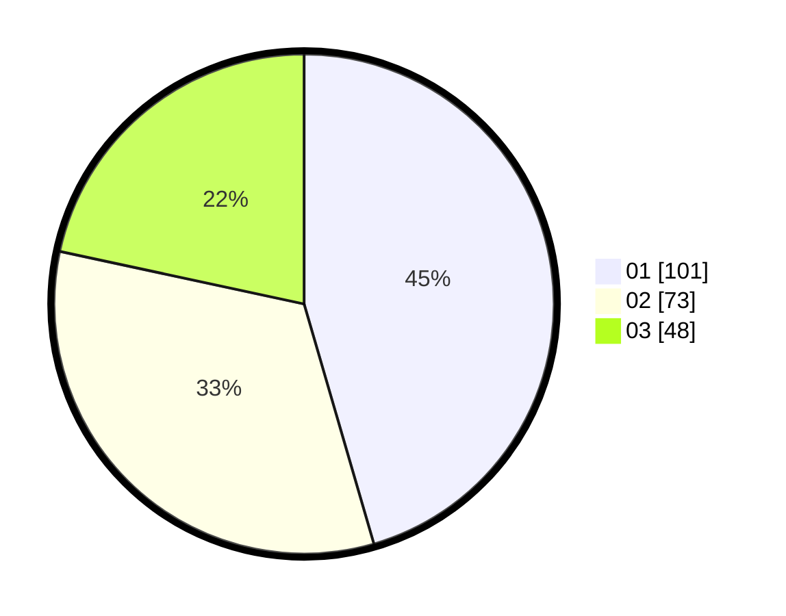

# Hasil

Hasil perolehan suara paslon dapat dilihat pada file paslon-01.txt, paslon-02.txt, dan paslon-03.txt.

Jika tidak ada, artinya data tersebut belum ada pada SIREKAP.

## Perolehan Suara

 * Paslon 01: **101**.
 * Paslon 02: **73**.
 * Paslon 03: **48**.

## Foto C Plano

https://sirekap-obj-formc.kpu.go.id/dbc3/pemilu/ppwp/31/73/08/10/04/3173081004010-20240214-214823--892e7894-28f6-4844-8cfc-03ed9dac861b.jpg

https://sirekap-obj-formc.kpu.go.id/dbc3/pemilu/ppwp/31/73/08/10/04/3173081004010-20240214-214950--5977e338-3492-4630-bb44-a116bd33585b.jpg

https://sirekap-obj-formc.kpu.go.id/dbc3/pemilu/ppwp/31/73/08/10/04/3173081004010-20240214-215134--5934b473-ba27-43c1-b636-8c332df3559e.jpg
