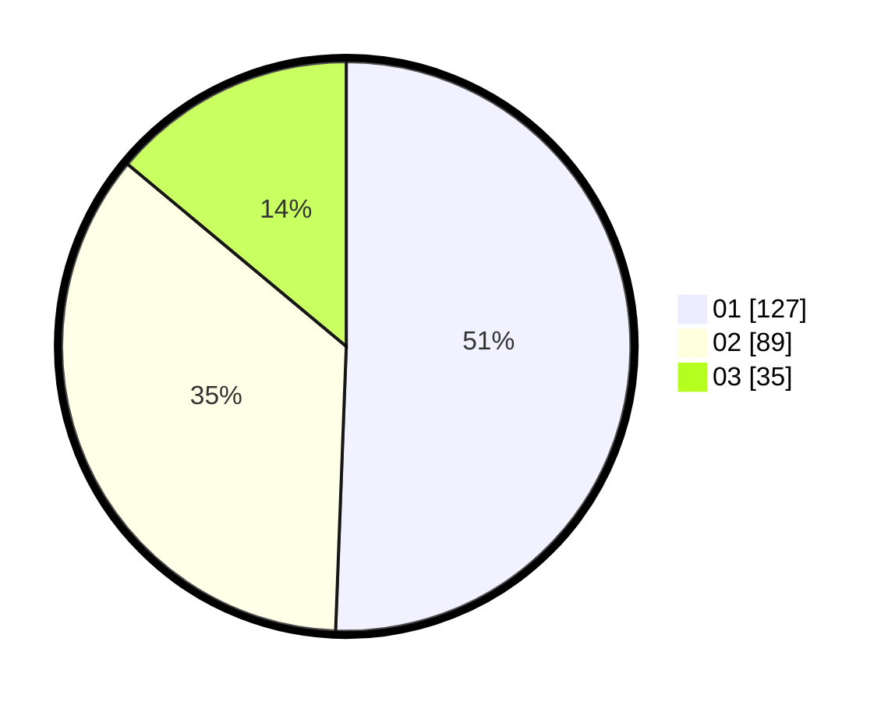

# Hasil

Hasil perolehan suara paslon dapat dilihat pada file paslon-01.txt, paslon-02.txt, dan paslon-03.txt.

Jika tidak ada, artinya data tersebut belum ada pada SIREKAP.

## Perolehan Suara

 * Paslon 01: **127**.
 * Paslon 02: **89**.
 * Paslon 03: **35**.

## Foto C Plano

https://sirekap-obj-formc.kpu.go.id/0440/pemilu/ppwp/31/73/08/10/04/3173081004012-20240217-040531--03d4c159-4fa4-4988-858c-17e5c75c3394.jpg

https://sirekap-obj-formc.kpu.go.id/0440/pemilu/ppwp/31/73/08/10/04/3173081004012-20240217-041641--2ab3262b-a57f-43d8-ad84-de90c0f513e4.jpg

https://sirekap-obj-formc.kpu.go.id/0440/pemilu/ppwp/31/73/08/10/04/3173081004012-20240217-042157--17818ffd-a6c4-47aa-870f-30b049a767f4.jpg

## DATA PEMILIH TETAP

Jumlah pemilih dalam DPT: **296**.
 * L: **147**.
 * P: **149**.

## DATA PENGGUNA HAK PILIH

Jumlah pengguna hak pilih dalam DPT: **251**.
 * L: **122**.
 * P: **129**.

Jumlah pengguna hak pilih dalam DPTb: **3**.
 * L: **1**.
 * P: **2**.

Jumlah pengguna hak pilih dalam DPK: **2**.
 * L: **2**.
 * P: **0**.

Jumlah pengguna hak pilih: **256**.
 * L: **125**.
 * P: **131**.

## JUMLAH SUARA SAH DAN TIDAK SAH

JUMLAH SELURUH SUARA SAH: **251**.

JUMLAH SUARA TIDAK SAH: **5**.

JUMLAH SELURUH SUARA SAH DAN SUARA TIDAK SAH: **256**.
