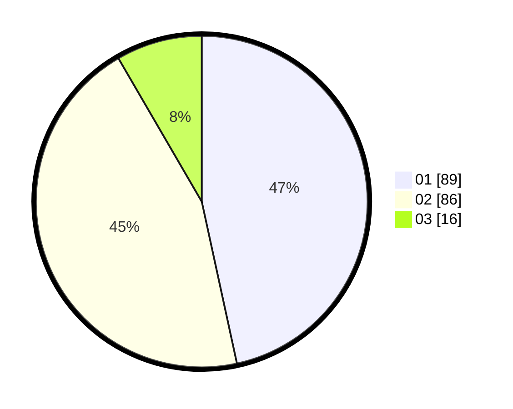

# Hasil

Hasil perolehan suara paslon dapat dilihat pada file paslon-01.txt, paslon-02.txt, dan paslon-03.txt.

Jika tidak ada, artinya data tersebut belum ada pada SIREKAP.

## Perolehan Suara

 * Paslon 01: **89**.
 * Paslon 02: **86**.
 * Paslon 03: **16**.

## Foto C Plano

https://sirekap-obj-formc.kpu.go.id/a819/pemilu/ppwp/31/73/08/10/04/3173081004034-20240214-230305--10b4aea1-887c-4cc6-b787-3657cc28d330.jpg

https://sirekap-obj-formc.kpu.go.id/a819/pemilu/ppwp/31/73/08/10/04/3173081004034-20240214-230347--ac4cca01-ebb4-47e1-83cf-f04b23391ad8.jpg

https://sirekap-obj-formc.kpu.go.id/a819/pemilu/ppwp/31/73/08/10/04/3173081004034-20240214-230415--2d03b18c-806e-4bd0-8972-70e4e8acda07.jpg
