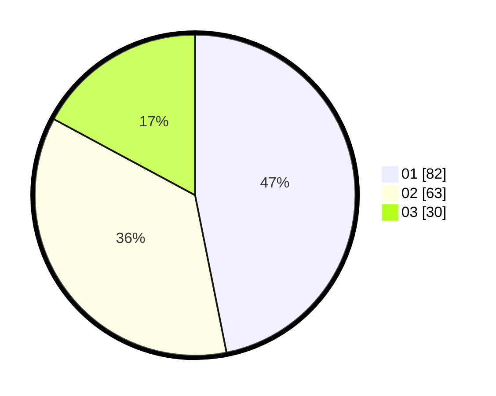

# Hasil

Hasil perolehan suara paslon dapat dilihat pada file paslon-01.txt, paslon-02.txt, dan paslon-03.txt.

Jika tidak ada, artinya data tersebut belum ada pada SIREKAP.

## Perolehan Suara

 * Paslon 01: **82**.
 * Paslon 02: **63**.
 * Paslon 03: **30**.

## Foto C Plano

https://sirekap-obj-formc.kpu.go.id/dac8/pemilu/ppwp/31/73/08/10/04/3173081004037-20240214-191251--a24e06e4-1a0b-45eb-a019-1faf6b435dc6.jpg

https://sirekap-obj-formc.kpu.go.id/dac8/pemilu/ppwp/31/73/08/10/04/3173081004037-20240214-220314--20c53bbf-e5b5-45b7-8611-5bd0bfbc969e.jpg

https://sirekap-obj-formc.kpu.go.id/dac8/pemilu/ppwp/31/73/08/10/04/3173081004037-20240214-220035--9b9fafcd-1965-4a6e-b865-4388221c2025.jpg

## DATA PEMILIH TETAP

Jumlah pemilih dalam DPT: **221**.
 * L: **108**.
 * P: **113**.

## DATA PENGGUNA HAK PILIH

Jumlah pengguna hak pilih dalam DPT: **170**.
 * L: **84**.
 * P: **86**.

Jumlah pengguna hak pilih dalam DPTb: **10**.
 * L: **9**.
 * P: **1**.

Jumlah pengguna hak pilih dalam DPK: **0**.
 * L: **0**.
 * P: **0**.

Jumlah pengguna hak pilih: **180**.
 * L: **93**.
 * P: **87**.

## JUMLAH SUARA SAH DAN TIDAK SAH

JUMLAH SELURUH SUARA SAH: **175**.

JUMLAH SUARA TIDAK SAH: **5**.

JUMLAH SELURUH SUARA SAH DAN SUARA TIDAK SAH: **180**.
