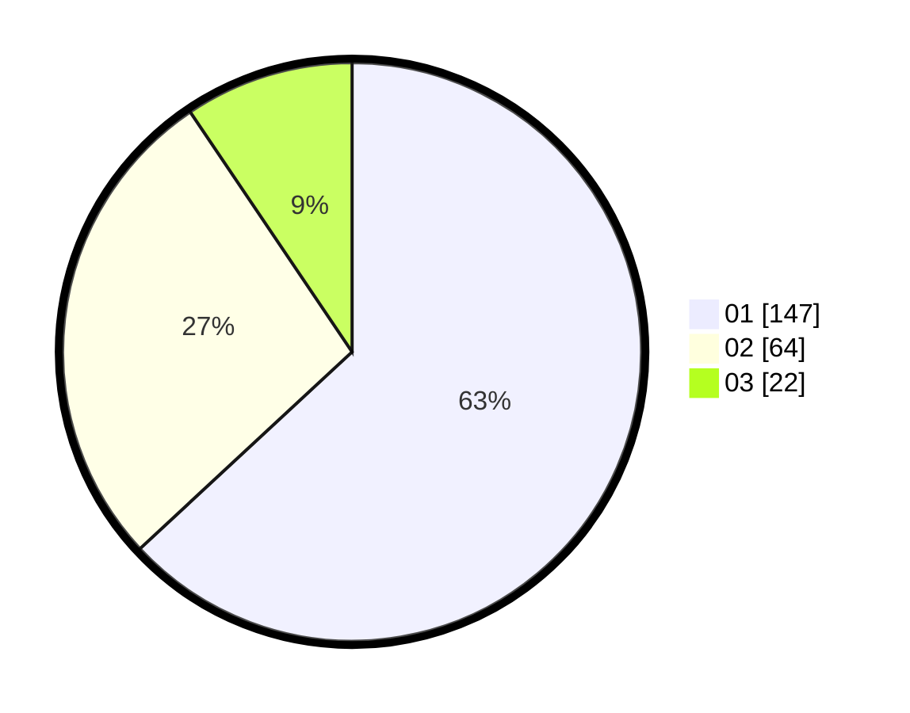

# Hasil

Hasil perolehan suara paslon dapat dilihat pada file paslon-01.txt, paslon-02.txt, dan paslon-03.txt.

Jika tidak ada, artinya data tersebut belum ada pada SIREKAP.

## Perolehan Suara

 * Paslon 01: **147**.
 * Paslon 02: **64**.
 * Paslon 03: **22**.

## Foto C Plano

https://sirekap-obj-formc.kpu.go.id/13a7/pemilu/ppwp/31/73/08/10/04/3173081004039-20240214-224236--3f8baa8f-c43c-4b10-becf-cd1a1a84f25f.jpg

https://sirekap-obj-formc.kpu.go.id/13a7/pemilu/ppwp/31/73/08/10/04/3173081004039-20240214-224434--e1899b1b-f42f-4d01-971f-abe91b61c8f9.jpg

https://sirekap-obj-formc.kpu.go.id/13a7/pemilu/ppwp/31/73/08/10/04/3173081004039-20240214-224616--8dad4599-ff91-4458-bda0-1d15d0337542.jpg
