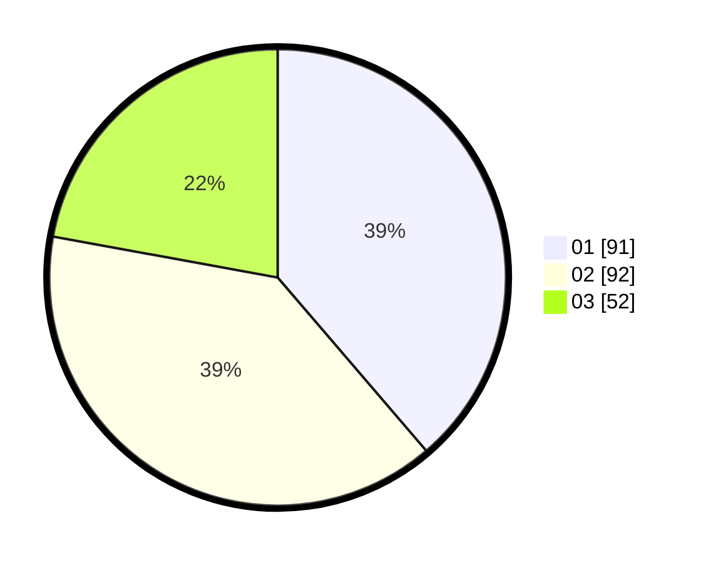

# Hasil

Hasil perolehan suara paslon dapat dilihat pada file paslon-01.txt, paslon-02.txt, dan paslon-03.txt.

Jika tidak ada, artinya data tersebut belum ada pada SIREKAP.

## Perolehan Suara

 * Paslon 01: **91**.
 * Paslon 02: **92**.
 * Paslon 03: **52**.

## Foto C Plano

https://sirekap-obj-formc.kpu.go.id/3463/pemilu/ppwp/31/73/08/10/04/3173081004040-20240215-003752--4a286a49-7916-427d-96f0-ab4aba91931a.jpg

https://sirekap-obj-formc.kpu.go.id/3463/pemilu/ppwp/31/73/08/10/04/3173081004040-20240215-010702--2ad9a753-d206-4bfb-a302-210c3f8dc2cc.jpg

https://sirekap-obj-formc.kpu.go.id/3463/pemilu/ppwp/31/73/08/10/04/3173081004040-20240215-010842--eb61f3a3-0061-481d-950f-8692f2d8da2b.jpg
