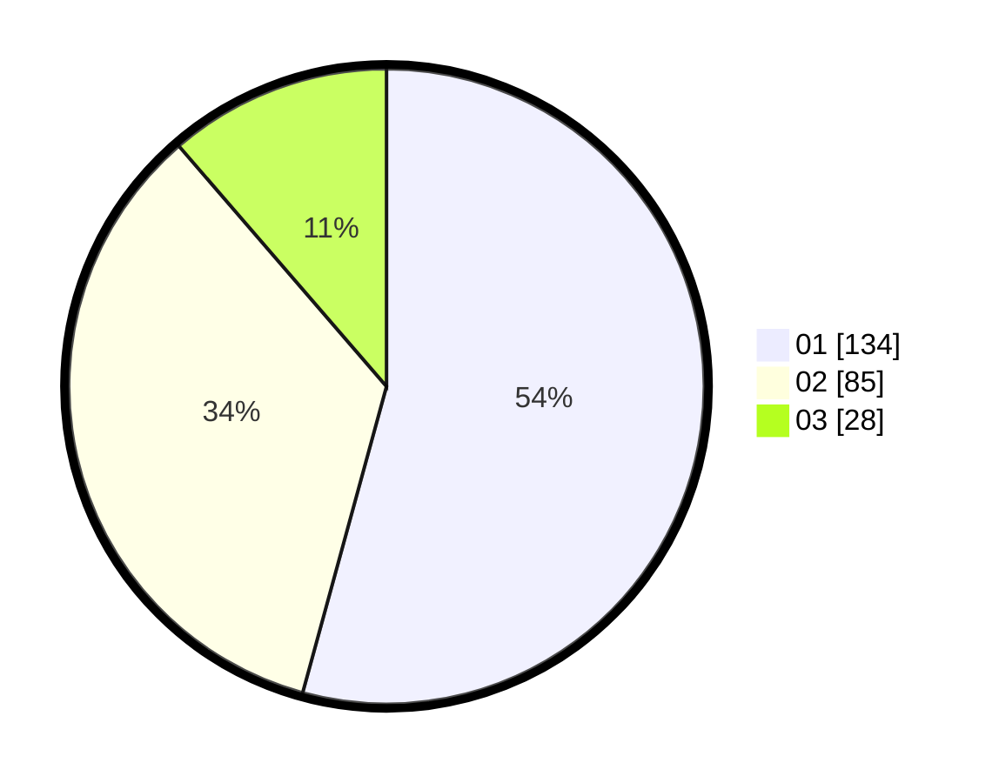

# Hasil

Hasil perolehan suara paslon dapat dilihat pada file paslon-01.txt, paslon-02.txt, dan paslon-03.txt.

Jika tidak ada, artinya data tersebut belum ada pada SIREKAP.

## Perolehan Suara

 * Paslon 01: **134**.
 * Paslon 02: **85**.
 * Paslon 03: **28**.

## Foto C Plano

https://sirekap-obj-formc.kpu.go.id/a527/pemilu/ppwp/31/73/08/10/04/3173081004042-20240214-204144--fd56af2d-4e8f-4ef1-b46a-e387fc4e90ea.jpg

https://sirekap-obj-formc.kpu.go.id/a527/pemilu/ppwp/31/73/08/10/04/3173081004042-20240214-204312--1451e04c-952f-45c7-b0c0-085b3e681159.jpg

https://sirekap-obj-formc.kpu.go.id/a527/pemilu/ppwp/31/73/08/10/04/3173081004042-20240214-204434--8ce6b06d-974d-4dc6-9e80-eeb50ef01f58.jpg

## DATA PEMILIH TETAP

Jumlah pemilih dalam DPT: **296**.
 * L: **153**.
 * P: **143**.

## DATA PENGGUNA HAK PILIH

Jumlah pengguna hak pilih dalam DPT: **225**.
 * L: **118**.
 * P: **107**.

Jumlah pengguna hak pilih dalam DPTb: **15**.
 * L: **9**.
 * P: **6**.

Jumlah pengguna hak pilih dalam DPK: **8**.
 * L: **3**.
 * P: **5**.

Jumlah pengguna hak pilih: **248**.
 * L: **130**.
 * P: **118**.

## JUMLAH SUARA SAH DAN TIDAK SAH

JUMLAH SELURUH SUARA SAH: **247**.

JUMLAH SUARA TIDAK SAH: **1**.

JUMLAH SELURUH SUARA SAH DAN SUARA TIDAK SAH: **248**.
