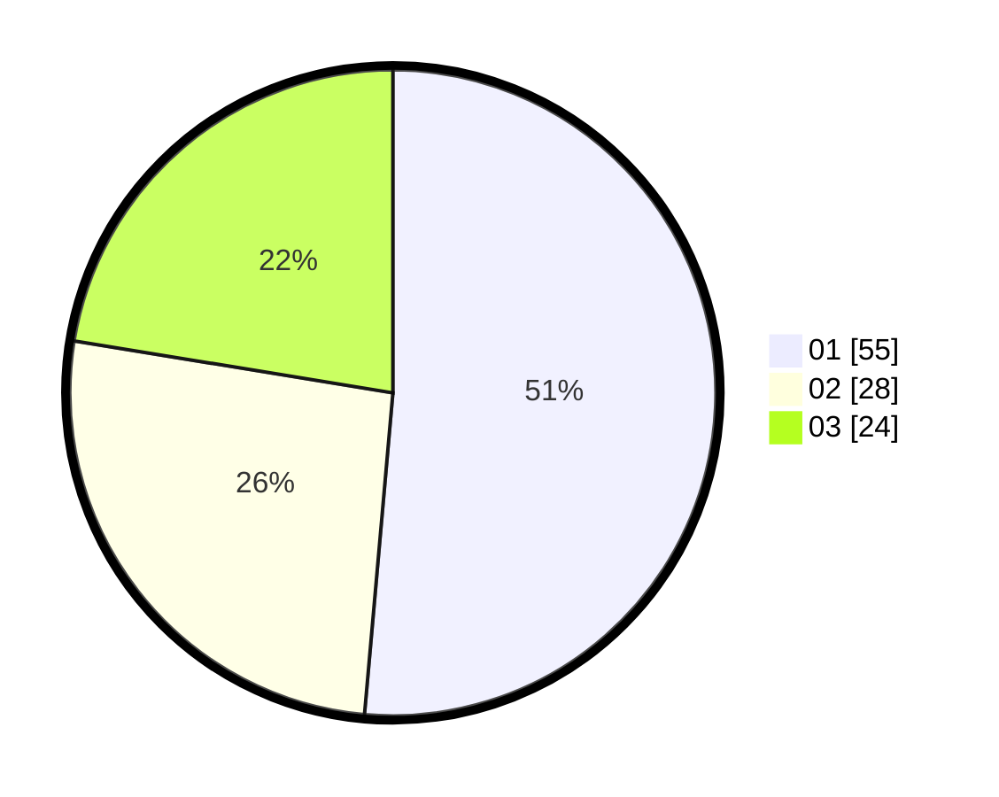

# Hasil

Hasil perolehan suara paslon dapat dilihat pada file paslon-01.txt, paslon-02.txt, dan paslon-03.txt.

Jika tidak ada, artinya data tersebut belum ada pada SIREKAP.

## Perolehan Suara

 * Paslon 01: **55**.
 * Paslon 02: **28**.
 * Paslon 03: **24**.

## Foto C Plano

https://sirekap-obj-formc.kpu.go.id/0349/pemilu/ppwp/31/73/08/10/04/3173081004045-20240215-172636--6cfee93a-ce04-46fe-950c-70281e21a0be.jpg

https://sirekap-obj-formc.kpu.go.id/0349/pemilu/ppwp/31/73/08/10/04/3173081004045-20240214-155133--5c8cb8ff-1d9b-4704-8ec3-9007e4687f77.jpg

https://sirekap-obj-formc.kpu.go.id/0349/pemilu/ppwp/31/73/08/10/04/3173081004045-20240214-155136--8b087c30-d3bc-4a93-9a62-defc6f8ca6bf.jpg
