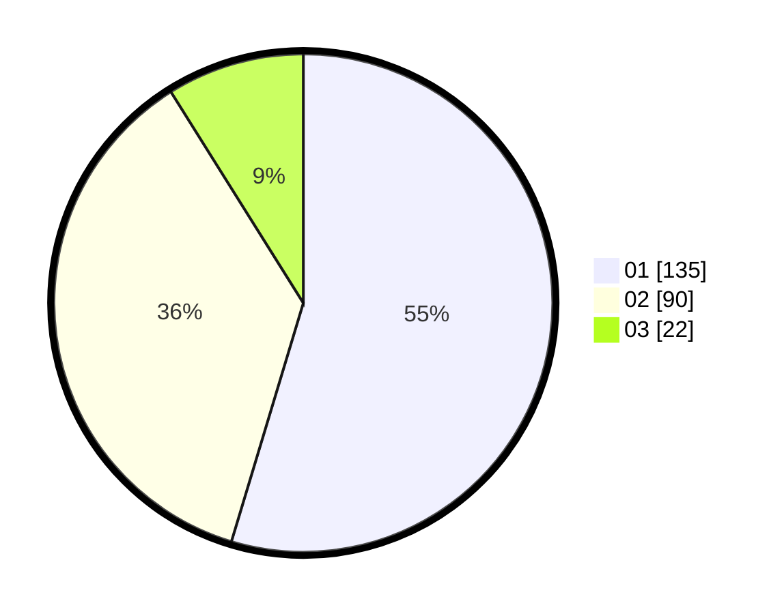

# Hasil

Hasil perolehan suara paslon dapat dilihat pada file paslon-01.txt, paslon-02.txt, dan paslon-03.txt.

Jika tidak ada, artinya data tersebut belum ada pada SIREKAP.

## Perolehan Suara

 * Paslon 01: **135**.
 * Paslon 02: **90**.
 * Paslon 03: **22**.

## Foto C Plano

https://sirekap-obj-formc.kpu.go.id/55e7/pemilu/ppwp/31/73/08/10/04/3173081004046-20240215-023120--01349ec0-e317-4a65-8e68-4a39ce7143ac.jpg

https://sirekap-obj-formc.kpu.go.id/55e7/pemilu/ppwp/31/73/08/10/04/3173081004046-20240215-023513--0c2acd03-4cd1-48d5-8de3-dc954ee29254.jpg

https://sirekap-obj-formc.kpu.go.id/55e7/pemilu/ppwp/31/73/08/10/04/3173081004046-20240215-023958--c69a477a-3043-40c1-b57e-8fb2559c558a.jpg
