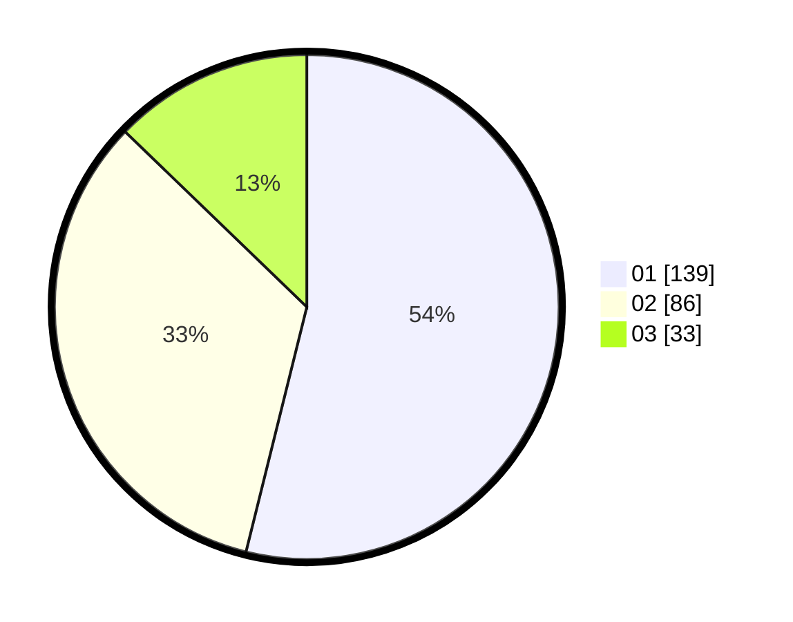

# Hasil

Hasil perolehan suara paslon dapat dilihat pada file paslon-01.txt, paslon-02.txt, dan paslon-03.txt.

Jika tidak ada, artinya data tersebut belum ada pada SIREKAP.

## Perolehan Suara

 * Paslon 01: **139**.
 * Paslon 02: **86**.
 * Paslon 03: **33**.

## Foto C Plano

https://sirekap-obj-formc.kpu.go.id/2c47/pemilu/ppwp/31/73/08/10/04/3173081004054-20240214-213126--fb300f08-bcb2-4284-8c4e-9f7b23e107d8.jpg

https://sirekap-obj-formc.kpu.go.id/2c47/pemilu/ppwp/31/73/08/10/04/3173081004054-20240214-213525--dc6933e3-81dd-495c-8dd4-c21a351731f0.jpg

https://sirekap-obj-formc.kpu.go.id/2c47/pemilu/ppwp/31/73/08/10/04/3173081004054-20240214-213935--b23a4bf8-61c0-4518-83d7-e3787d277e7e.jpg

## DATA PEMILIH TETAP

Jumlah pemilih dalam DPT: **288**.
 * L: **146**.
 * P: **136**.

## DATA PENGGUNA HAK PILIH

Jumlah pengguna hak pilih dalam DPT: **248**.
 * L: **128**.
 * P: **120**.

Jumlah pengguna hak pilih dalam DPTb: **8**.
 * L: **4**.
 * P: **4**.

Jumlah pengguna hak pilih dalam DPK: **3**.
 * L: **2**.
 * P: **1**.

Jumlah pengguna hak pilih: **259**.
 * L: **134**.
 * P: **125**.

## JUMLAH SUARA SAH DAN TIDAK SAH

JUMLAH SELURUH SUARA SAH: **258**.

JUMLAH SUARA TIDAK SAH: **1**.

JUMLAH SELURUH SUARA SAH DAN SUARA TIDAK SAH: **259**.
