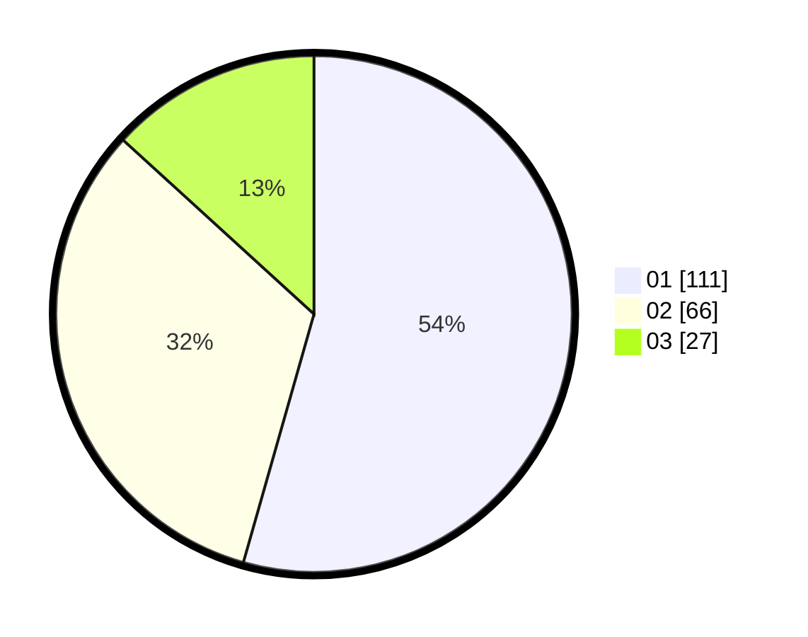

# Hasil

Hasil perolehan suara paslon dapat dilihat pada file paslon-01.txt, paslon-02.txt, dan paslon-03.txt.

Jika tidak ada, artinya data tersebut belum ada pada SIREKAP.

## Perolehan Suara

 * Paslon 01: **111**.
 * Paslon 02: **66**.
 * Paslon 03: **27**.

## Foto C Plano

https://sirekap-obj-formc.kpu.go.id/656d/pemilu/ppwp/31/73/08/10/04/3173081004055-20240214-233800--f28739b8-bdc1-4ab3-a696-1d9f7e0ae876.jpg

https://sirekap-obj-formc.kpu.go.id/656d/pemilu/ppwp/31/73/08/10/04/3173081004055-20240214-233832--73b6e8a5-672e-48aa-a38c-b3c0f6a5631e.jpg

https://sirekap-obj-formc.kpu.go.id/656d/pemilu/ppwp/31/73/08/10/04/3173081004055-20240214-233904--192bd619-3457-4d81-80bf-133c8eb5b15e.jpg

## DATA PEMILIH TETAP

Jumlah pemilih dalam DPT: **251**.
 * L: **122**.
 * P: **129**.

## DATA PENGGUNA HAK PILIH

Jumlah pengguna hak pilih dalam DPT: **198**.
 * L: **92**.
 * P: **106**.

Jumlah pengguna hak pilih dalam DPTb: **3**.
 * L: **1**.
 * P: **2**.

Jumlah pengguna hak pilih dalam DPK: **4**.
 * L: **2**.
 * P: **2**.

Jumlah pengguna hak pilih: **205**.
 * L: **95**.
 * P: **110**.

## JUMLAH SUARA SAH DAN TIDAK SAH

JUMLAH SELURUH SUARA SAH: **204**.

JUMLAH SUARA TIDAK SAH: **1**.

JUMLAH SELURUH SUARA SAH DAN SUARA TIDAK SAH: **205**.
