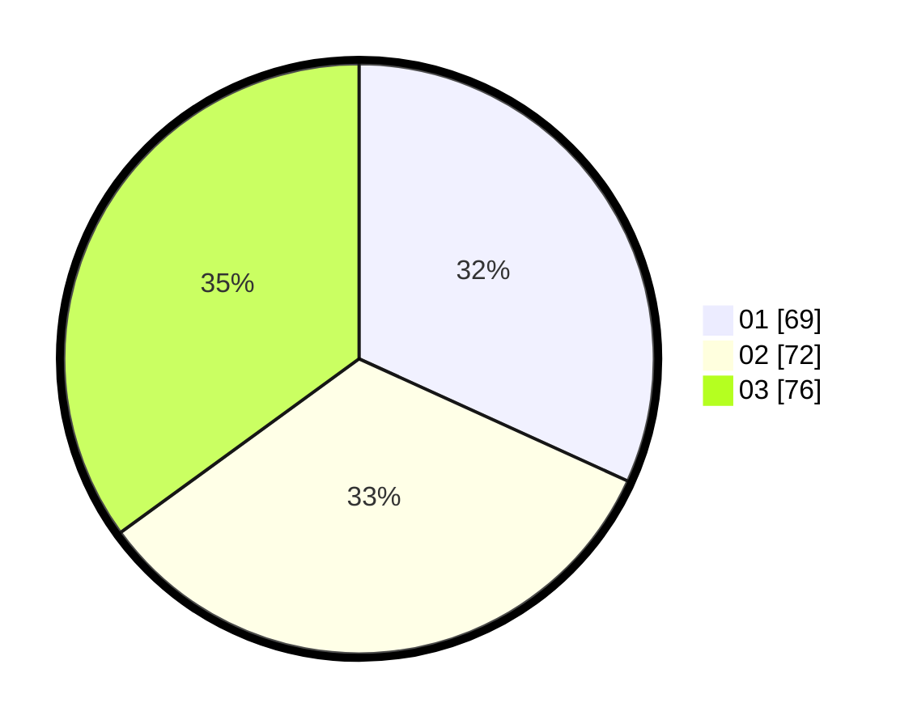

# Hasil

Hasil perolehan suara paslon dapat dilihat pada file paslon-01.txt, paslon-02.txt, dan paslon-03.txt.

Jika tidak ada, artinya data tersebut belum ada pada SIREKAP.

## Perolehan Suara

 * Paslon 01: **69**.
 * Paslon 02: **72**.
 * Paslon 03: **76**.

## Foto C Plano

https://sirekap-obj-formc.kpu.go.id/fdd0/pemilu/ppwp/31/73/08/10/04/3173081004058-20240214-235739--194acde3-bec2-41a9-9a88-7d80633a96a3.jpg

https://sirekap-obj-formc.kpu.go.id/fdd0/pemilu/ppwp/31/73/08/10/04/3173081004058-20240214-235858--f4f0b193-a798-4e0e-8dc9-e34036b90593.jpg

https://sirekap-obj-formc.kpu.go.id/fdd0/pemilu/ppwp/31/73/08/10/04/3173081004058-20240214-235858--f75aabda-13fd-4857-b871-6370c0e7a82c.jpg
