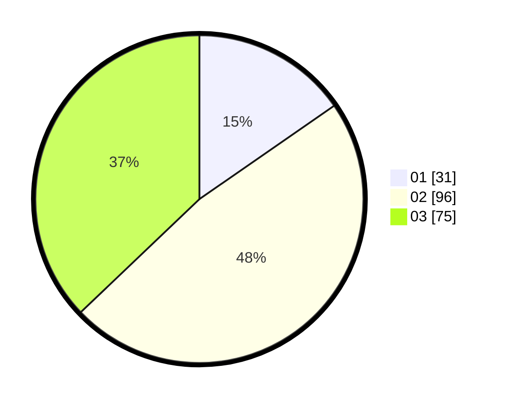

# Hasil

Hasil perolehan suara paslon dapat dilihat pada file paslon-01.txt, paslon-02.txt, dan paslon-03.txt.

Jika tidak ada, artinya data tersebut belum ada pada SIREKAP.

## Perolehan Suara

 * Paslon 01: **31**.
 * Paslon 02: **96**.
 * Paslon 03: **75**.

## Foto C Plano

https://sirekap-obj-formc.kpu.go.id/1ffd/pemilu/ppwp/31/73/08/10/04/3173081004059-20240216-025221--8fdaa8bd-73e2-4ca3-b641-ab0f4ae6d9f6.jpg

https://sirekap-obj-formc.kpu.go.id/1ffd/pemilu/ppwp/31/73/08/10/04/3173081004059-20240214-190814--6e576cbc-9982-4e47-9bd2-847b0080bf9c.jpg

https://sirekap-obj-formc.kpu.go.id/1ffd/pemilu/ppwp/31/73/08/10/04/3173081004059-20240216-025222--2e146f9e-5b9f-4cf4-891b-0c619ecf1c93.jpg

## DATA PEMILIH TETAP

Jumlah pemilih dalam DPT: **266**.
 * L: **120**.
 * P: **146**.

## DATA PENGGUNA HAK PILIH

Jumlah pengguna hak pilih dalam DPT: **198**.
 * L: **90**.
 * P: **108**.

Jumlah pengguna hak pilih dalam DPTb: **4**.
 * L: **3**.
 * P: **1**.

Jumlah pengguna hak pilih dalam DPK: **1**.
 * L: **1**.
 * P: **0**.

Jumlah pengguna hak pilih: **203**.
 * L: **94**.
 * P: **109**.

## JUMLAH SUARA SAH DAN TIDAK SAH

JUMLAH SELURUH SUARA SAH: **202**.

JUMLAH SUARA TIDAK SAH: **1**.

JUMLAH SELURUH SUARA SAH DAN SUARA TIDAK SAH: **203**.
