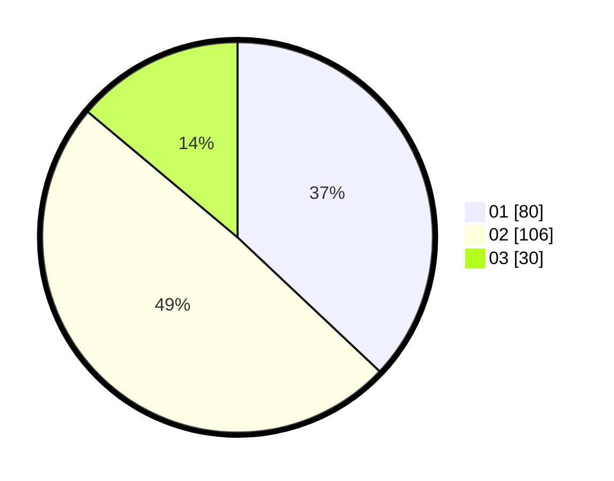

# Hasil

Hasil perolehan suara paslon dapat dilihat pada file paslon-01.txt, paslon-02.txt, dan paslon-03.txt.

Jika tidak ada, artinya data tersebut belum ada pada SIREKAP.

## Perolehan Suara

 * Paslon 01: **80**.
 * Paslon 02: **106**.
 * Paslon 03: **30**.

## Foto C Plano

https://sirekap-obj-formc.kpu.go.id/f5be/pemilu/ppwp/31/73/08/10/04/3173081004061-20240214-155328--1ef292aa-ae34-4dbc-856d-d4e6065f0e67.jpg

https://sirekap-obj-formc.kpu.go.id/f5be/pemilu/ppwp/31/73/08/10/04/3173081004061-20240214-155426--929adeef-3d58-4aad-82da-8d9e900f136d.jpg

https://sirekap-obj-formc.kpu.go.id/f5be/pemilu/ppwp/31/73/08/10/04/3173081004061-20240214-155456--2c573080-96ae-4d48-a82f-c15ec6e3fa7e.jpg

## DATA PEMILIH TETAP

Jumlah pemilih dalam DPT: **249**.
 * L: **103**.
 * P: **445**.

## DATA PENGGUNA HAK PILIH

Jumlah pengguna hak pilih dalam DPT: **285**.
 * L: **239**.
 * P: **46**.

Jumlah pengguna hak pilih dalam DPTb: **0**.
 * L: **0**.
 * P: **4**.

Jumlah pengguna hak pilih dalam DPK: **0**.
 * L: **0**.
 * P: **0**.

Jumlah pengguna hak pilih: **285**.
 * L: **429**.
 * P: **447**.

## JUMLAH SUARA SAH DAN TIDAK SAH

JUMLAH SELURUH SUARA SAH: **216**.

JUMLAH SUARA TIDAK SAH: **3**.

JUMLAH SELURUH SUARA SAH DAN SUARA TIDAK SAH: **219**.
