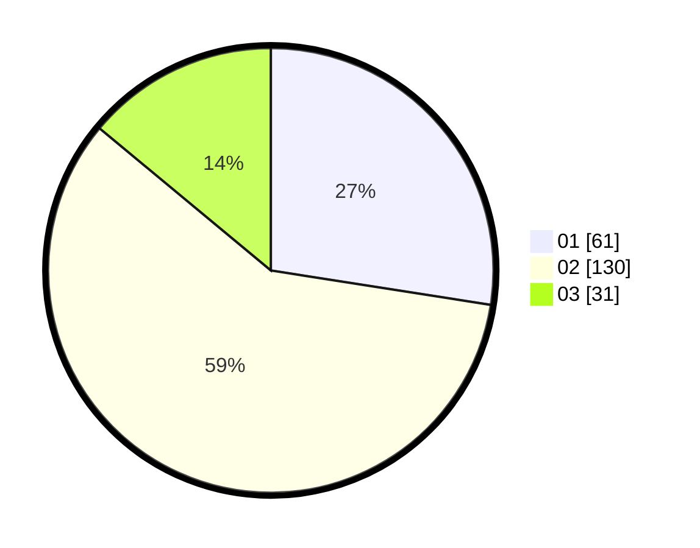

# Hasil

Hasil perolehan suara paslon dapat dilihat pada file paslon-01.txt, paslon-02.txt, dan paslon-03.txt.

Jika tidak ada, artinya data tersebut belum ada pada SIREKAP.

## Perolehan Suara

 * Paslon 01: **61**.
 * Paslon 02: **130**.
 * Paslon 03: **31**.

## Foto C Plano

https://sirekap-obj-formc.kpu.go.id/d479/pemilu/ppwp/31/73/08/10/04/3173081004063-20240214-185835--a558ce4d-76ea-423f-b01b-91ee04288882.jpg

https://sirekap-obj-formc.kpu.go.id/d479/pemilu/ppwp/31/73/08/10/04/3173081004063-20240214-185928--d7a7a3e9-7199-42e2-a691-249d1b2c3f44.jpg

https://sirekap-obj-formc.kpu.go.id/d479/pemilu/ppwp/31/73/08/10/04/3173081004063-20240214-190347--f33120c4-99e6-4db4-b5c7-7a9b549702c4.jpg

## DATA PEMILIH TETAP

Jumlah pemilih dalam DPT: **281**.
 * L: **139**.
 * P: **142**.

## DATA PENGGUNA HAK PILIH

Jumlah pengguna hak pilih dalam DPT: **225**.
 * L: **106**.
 * P: **119**.

Jumlah pengguna hak pilih dalam DPTb: **1**.
 * L: **0**.
 * P: **1**.

Jumlah pengguna hak pilih dalam DPK: **0**.
 * L: **0**.
 * P: **0**.

Jumlah pengguna hak pilih: **226**.
 * L: **106**.
 * P: **120**.

## JUMLAH SUARA SAH DAN TIDAK SAH

JUMLAH SELURUH SUARA SAH: **222**.

JUMLAH SUARA TIDAK SAH: **4**.

JUMLAH SELURUH SUARA SAH DAN SUARA TIDAK SAH: **226**.
