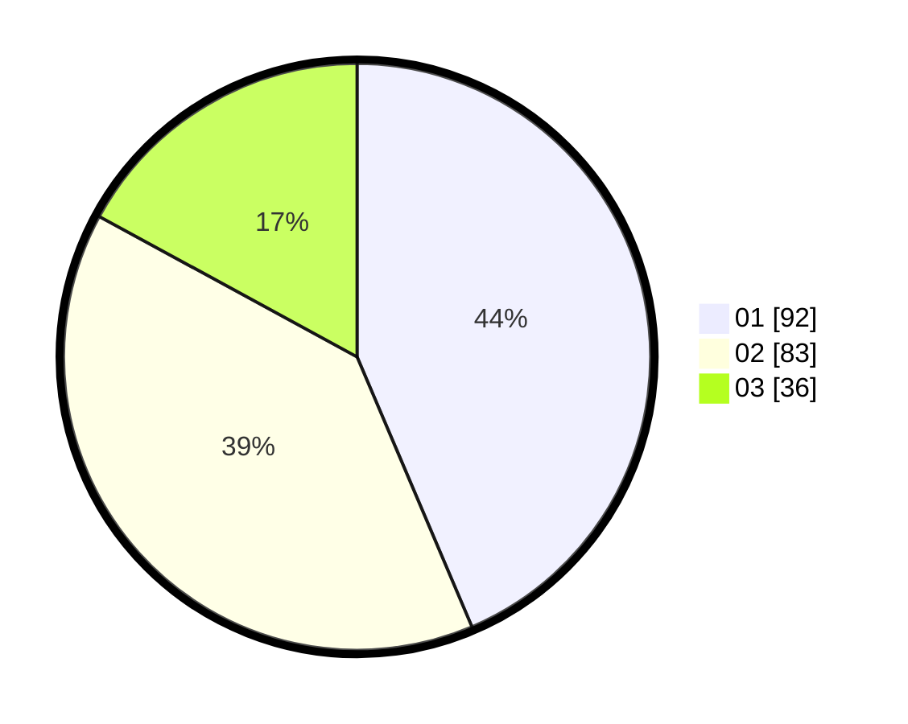

# Hasil

Hasil perolehan suara paslon dapat dilihat pada file paslon-01.txt, paslon-02.txt, dan paslon-03.txt.

Jika tidak ada, artinya data tersebut belum ada pada SIREKAP.

## Perolehan Suara

 * Paslon 01: **92**.
 * Paslon 02: **83**.
 * Paslon 03: **36**.

## Foto C Plano

https://sirekap-obj-formc.kpu.go.id/c521/pemilu/ppwp/31/73/08/10/04/3173081004065-20240214-232337--af564ac6-d321-4ef4-a5d4-439316966da7.jpg

https://sirekap-obj-formc.kpu.go.id/c521/pemilu/ppwp/31/73/08/10/04/3173081004065-20240214-232407--f9694a73-9a6e-4598-9bc0-482ba77622df.jpg

https://sirekap-obj-formc.kpu.go.id/c521/pemilu/ppwp/31/73/08/10/04/3173081004065-20240214-232439--253059e6-8fe9-4181-a0be-9ebd9045f181.jpg
