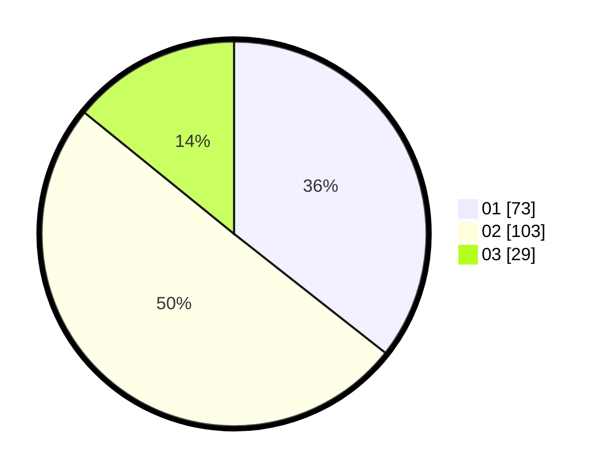

# Hasil

Hasil perolehan suara paslon dapat dilihat pada file paslon-01.txt, paslon-02.txt, dan paslon-03.txt.

Jika tidak ada, artinya data tersebut belum ada pada SIREKAP.

## Perolehan Suara

 * Paslon 01: **73**.
 * Paslon 02: **103**.
 * Paslon 03: **29**.

## Foto C Plano

https://sirekap-obj-formc.kpu.go.id/1212/pemilu/ppwp/31/73/08/10/04/3173081004066-20240215-010432--c9d1fd07-df52-4486-8c08-36a7f8fc56d2.jpg

https://sirekap-obj-formc.kpu.go.id/1212/pemilu/ppwp/31/73/08/10/04/3173081004066-20240215-010558--c9176cb4-9f4a-4117-b1bd-8ed01f5c69ff.jpg

https://sirekap-obj-formc.kpu.go.id/1212/pemilu/ppwp/31/73/08/10/04/3173081004066-20240215-010703--44e86083-e149-4dd2-9628-c5478723e9bf.jpg
