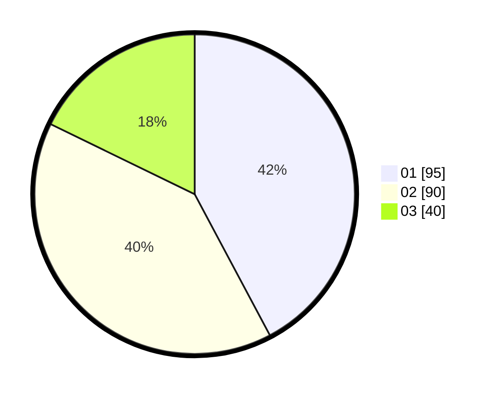

# Hasil

Hasil perolehan suara paslon dapat dilihat pada file paslon-01.txt, paslon-02.txt, dan paslon-03.txt.

Jika tidak ada, artinya data tersebut belum ada pada SIREKAP.

## Perolehan Suara

 * Paslon 01: **95**.
 * Paslon 02: **90**.
 * Paslon 03: **40**.

## Foto C Plano

https://sirekap-obj-formc.kpu.go.id/5bd2/pemilu/ppwp/31/73/08/10/04/3173081004070-20240214-191505--10bfa10d-aa0c-478c-89b9-a1268972bfca.jpg

https://sirekap-obj-formc.kpu.go.id/5bd2/pemilu/ppwp/31/73/08/10/04/3173081004070-20240214-191610--c08699ab-a8f7-4f34-aaf7-d2e98a3bb451.jpg

https://sirekap-obj-formc.kpu.go.id/5bd2/pemilu/ppwp/31/73/08/10/04/3173081004070-20240214-192115--8898333c-ee0e-40bd-9528-fc8cf1bec2b7.jpg
