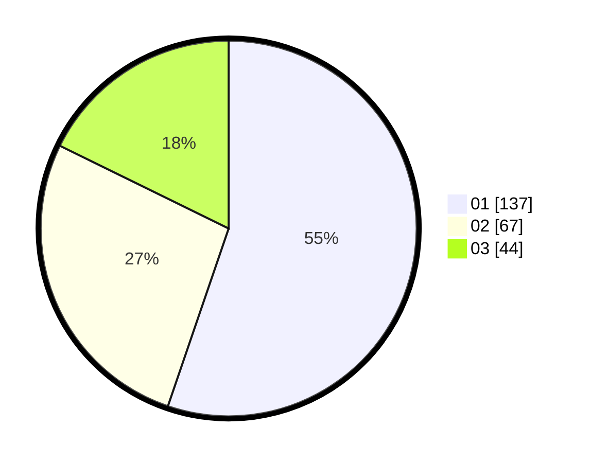

# Hasil

Hasil perolehan suara paslon dapat dilihat pada file paslon-01.txt, paslon-02.txt, dan paslon-03.txt.

Jika tidak ada, artinya data tersebut belum ada pada SIREKAP.

## Perolehan Suara

 * Paslon 01: **137**.
 * Paslon 02: **67**.
 * Paslon 03: **44**.

## Foto C Plano

https://sirekap-obj-formc.kpu.go.id/b32d/pemilu/ppwp/31/73/08/10/04/3173081004071-20240216-142408--9dabf940-c509-4b98-926c-4b05fdf0542a.jpg

https://sirekap-obj-formc.kpu.go.id/b32d/pemilu/ppwp/31/73/08/10/04/3173081004071-20240214-200635--f6a591a5-92da-4023-99e7-e1e25682d581.jpg

https://sirekap-obj-formc.kpu.go.id/b32d/pemilu/ppwp/31/73/08/10/04/3173081004071-20240214-211234--3869117d-1620-47b0-93cd-7afae3de43fb.jpg

## DATA PEMILIH TETAP

Jumlah pemilih dalam DPT: **0**.
 * L: **0**.
 * P: **0**.

## DATA PENGGUNA HAK PILIH

Jumlah pengguna hak pilih dalam DPT: **0**.
 * L: **0**.
 * P: **0**.

Jumlah pengguna hak pilih dalam DPTb: **0**.
 * L: **0**.
 * P: **0**.

Jumlah pengguna hak pilih dalam DPK: **0**.
 * L: **0**.
 * P: **0**.

Jumlah pengguna hak pilih: **0**.
 * L: **0**.
 * P: **0**.

## JUMLAH SUARA SAH DAN TIDAK SAH

JUMLAH SELURUH SUARA SAH: **47**.

JUMLAH SUARA TIDAK SAH: **7**.

JUMLAH SELURUH SUARA SAH DAN SUARA TIDAK SAH: **51**.
