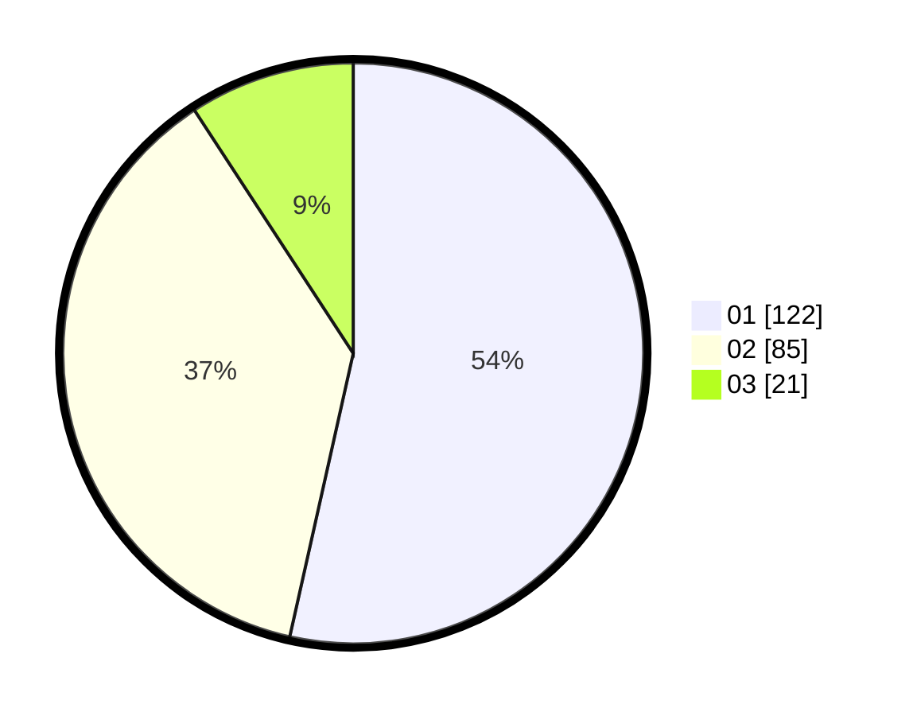

# Hasil

Hasil perolehan suara paslon dapat dilihat pada file paslon-01.txt, paslon-02.txt, dan paslon-03.txt.

Jika tidak ada, artinya data tersebut belum ada pada SIREKAP.

## Perolehan Suara

 * Paslon 01: **122**.
 * Paslon 02: **85**.
 * Paslon 03: **21**.

## Foto C Plano

https://sirekap-obj-formc.kpu.go.id/d71e/pemilu/ppwp/31/73/08/10/04/3173081004076-20240214-231055--e5f05993-c8d6-4a28-bd8c-05fbe7f61942.jpg

https://sirekap-obj-formc.kpu.go.id/d71e/pemilu/ppwp/31/73/08/10/04/3173081004076-20240214-231145--9130ca37-7662-43c1-b928-38dffdcd16fb.jpg

https://sirekap-obj-formc.kpu.go.id/d71e/pemilu/ppwp/31/73/08/10/04/3173081004076-20240214-231214--1f6917df-cc5a-469a-a220-ab4e040c099d.jpg
