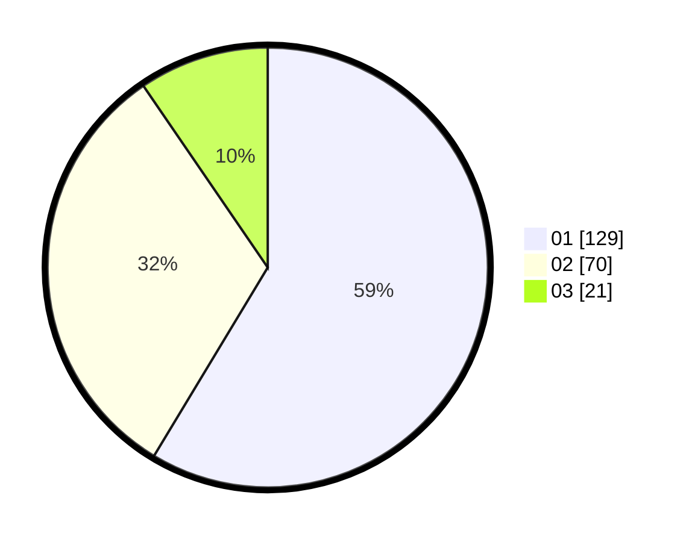

# Hasil

Hasil perolehan suara paslon dapat dilihat pada file paslon-01.txt, paslon-02.txt, dan paslon-03.txt.

Jika tidak ada, artinya data tersebut belum ada pada SIREKAP.

## Perolehan Suara

 * Paslon 01: **129**.
 * Paslon 02: **70**.
 * Paslon 03: **21**.

## Foto C Plano

https://sirekap-obj-formc.kpu.go.id/1755/pemilu/ppwp/31/73/08/10/04/3173081004077-20240214-185027--e2dba714-4c4e-4885-be95-4e7960bdd53b.jpg

https://sirekap-obj-formc.kpu.go.id/1755/pemilu/ppwp/31/73/08/10/04/3173081004077-20240215-024756--8742a642-ba68-4086-bbe6-72a0f73d53a0.jpg

https://sirekap-obj-formc.kpu.go.id/1755/pemilu/ppwp/31/73/08/10/04/3173081004077-20240214-184926--d0a0f778-f631-4868-aae7-30cf59c99141.jpg

## DATA PEMILIH TETAP

Jumlah pemilih dalam DPT: **287**.
 * L: **142**.
 * P: **145**.

## DATA PENGGUNA HAK PILIH

Jumlah pengguna hak pilih dalam DPT: **223**.
 * L: **107**.
 * P: **116**.

Jumlah pengguna hak pilih dalam DPTb: **0**.
 * L: **0**.
 * P: **0**.

Jumlah pengguna hak pilih dalam DPK: **1**.
 * L: **0**.
 * P: **1**.

Jumlah pengguna hak pilih: **224**.
 * L: **107**.
 * P: **117**.

## JUMLAH SUARA SAH DAN TIDAK SAH

JUMLAH SELURUH SUARA SAH: **220**.

JUMLAH SUARA TIDAK SAH: **4**.

JUMLAH SELURUH SUARA SAH DAN SUARA TIDAK SAH: **224**.
