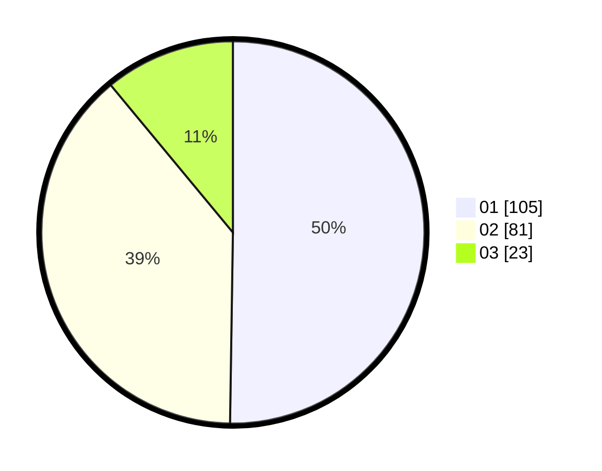

# Hasil

Hasil perolehan suara paslon dapat dilihat pada file paslon-01.txt, paslon-02.txt, dan paslon-03.txt.

Jika tidak ada, artinya data tersebut belum ada pada SIREKAP.

## Perolehan Suara

 * Paslon 01: **105**.
 * Paslon 02: **81**.
 * Paslon 03: **23**.

## Foto C Plano

https://sirekap-obj-formc.kpu.go.id/93d8/pemilu/ppwp/31/73/08/10/04/3173081004079-20240214-225002--6ca25567-49b8-4876-84a0-13429aa0a7fa.jpg

https://sirekap-obj-formc.kpu.go.id/93d8/pemilu/ppwp/31/73/08/10/04/3173081004079-20240214-202748--748098d0-8452-4ddd-a28e-69abcf0e7b3d.jpg

https://sirekap-obj-formc.kpu.go.id/93d8/pemilu/ppwp/31/73/08/10/04/3173081004079-20240214-225135--8e251401-6d74-48f5-8e24-b666ad39b99a.jpg

## DATA PEMILIH TETAP

Jumlah pemilih dalam DPT: **73**.
 * L: **174**.
 * P: **139**.

## DATA PENGGUNA HAK PILIH

Jumlah pengguna hak pilih dalam DPT: **207**.
 * L: **97**.
 * P: **110**.

Jumlah pengguna hak pilih dalam DPTb: **1**.
 * L: **0**.
 * P: **1**.

Jumlah pengguna hak pilih dalam DPK: **3**.
 * L: **1**.
 * P: **2**.

Jumlah pengguna hak pilih: **211**.
 * L: **98**.
 * P: **113**.

## JUMLAH SUARA SAH DAN TIDAK SAH

JUMLAH SELURUH SUARA SAH: **209**.

JUMLAH SUARA TIDAK SAH: **2**.

JUMLAH SELURUH SUARA SAH DAN SUARA TIDAK SAH: **211**.
