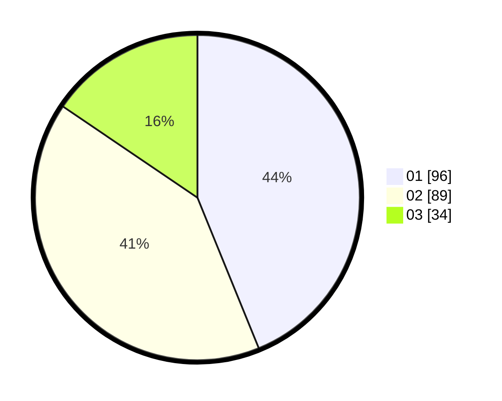

# Hasil

Hasil perolehan suara paslon dapat dilihat pada file paslon-01.txt, paslon-02.txt, dan paslon-03.txt.

Jika tidak ada, artinya data tersebut belum ada pada SIREKAP.

## Perolehan Suara

 * Paslon 01: **96**.
 * Paslon 02: **89**.
 * Paslon 03: **34**.

## Foto C Plano

https://sirekap-obj-formc.kpu.go.id/6bc1/pemilu/ppwp/31/73/08/10/04/3173081004080-20240214-232856--102d0f54-906f-48a0-93d8-ce4184d596da.jpg

https://sirekap-obj-formc.kpu.go.id/6bc1/pemilu/ppwp/31/73/08/10/04/3173081004080-20240214-231930--fe02b9b6-4717-463b-988c-9c41f0ed494b.jpg

https://sirekap-obj-formc.kpu.go.id/6bc1/pemilu/ppwp/31/73/08/10/04/3173081004080-20240214-232016--f8695ee8-5659-48a1-8f98-ac43530667ab.jpg
