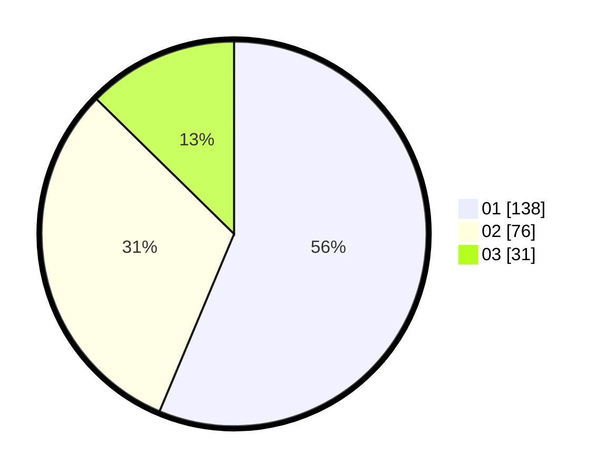

# Hasil

Hasil perolehan suara paslon dapat dilihat pada file paslon-01.txt, paslon-02.txt, dan paslon-03.txt.

Jika tidak ada, artinya data tersebut belum ada pada SIREKAP.

## Perolehan Suara

 * Paslon 01: **138**.
 * Paslon 02: **76**.
 * Paslon 03: **31**.

## Foto C Plano

https://sirekap-obj-formc.kpu.go.id/eb7f/pemilu/ppwp/31/73/08/10/04/3173081004085-20240215-205429--3f982d25-20ba-4648-a044-da159ee598f7.jpg

https://sirekap-obj-formc.kpu.go.id/eb7f/pemilu/ppwp/31/73/08/10/04/3173081004085-20240215-205430--d3f9b187-a2e4-4cd6-b228-ef698d07a0ba.jpg

https://sirekap-obj-formc.kpu.go.id/eb7f/pemilu/ppwp/31/73/08/10/04/3173081004085-20240215-205429--81903a73-f55c-48ff-a69c-a829b2282e33.jpg

## DATA PEMILIH TETAP

Jumlah pemilih dalam DPT: **293**.
 * L: **149**.
 * P: **144**.

## DATA PENGGUNA HAK PILIH

Jumlah pengguna hak pilih dalam DPT: **234**.
 * L: **118**.
 * P: **116**.

Jumlah pengguna hak pilih dalam DPTb: **4**.
 * L: **2**.
 * P: **2**.

Jumlah pengguna hak pilih dalam DPK: **8**.
 * L: **4**.
 * P: **4**.

Jumlah pengguna hak pilih: **246**.
 * L: **124**.
 * P: **122**.

## JUMLAH SUARA SAH DAN TIDAK SAH

JUMLAH SELURUH SUARA SAH: **245**.

JUMLAH SUARA TIDAK SAH: **1**.

JUMLAH SELURUH SUARA SAH DAN SUARA TIDAK SAH: **246**.
