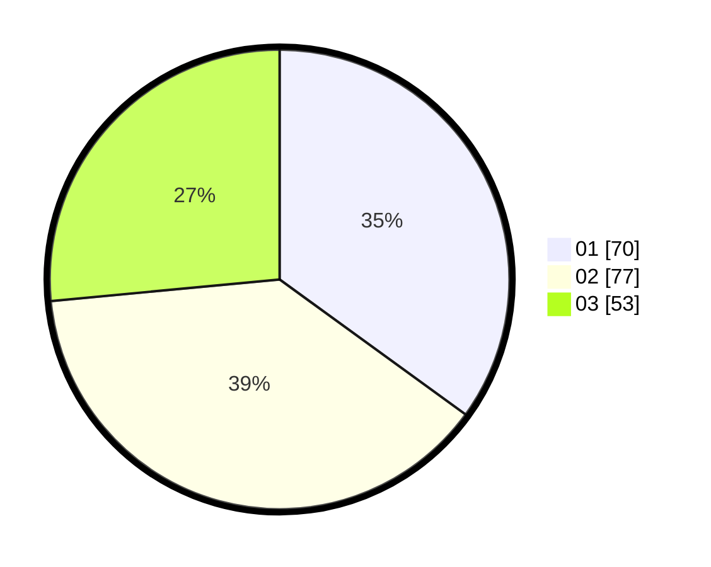

# Hasil

Hasil perolehan suara paslon dapat dilihat pada file paslon-01.txt, paslon-02.txt, dan paslon-03.txt.

Jika tidak ada, artinya data tersebut belum ada pada SIREKAP.

## Perolehan Suara

 * Paslon 01: **70**.
 * Paslon 02: **77**.
 * Paslon 03: **53**.

## Foto C Plano

https://sirekap-obj-formc.kpu.go.id/b83d/pemilu/ppwp/31/73/08/10/04/3173081004090-20240214-232502--34675d95-dab5-43da-b488-1e169854f554.jpg

https://sirekap-obj-formc.kpu.go.id/b83d/pemilu/ppwp/31/73/08/10/04/3173081004090-20240214-231738--35452a7a-b9d8-4ba1-b578-b0c59251797a.jpg

https://sirekap-obj-formc.kpu.go.id/b83d/pemilu/ppwp/31/73/08/10/04/3173081004090-20240214-232643--d11bd04e-2b6b-4654-9128-cf18c60082d9.jpg
