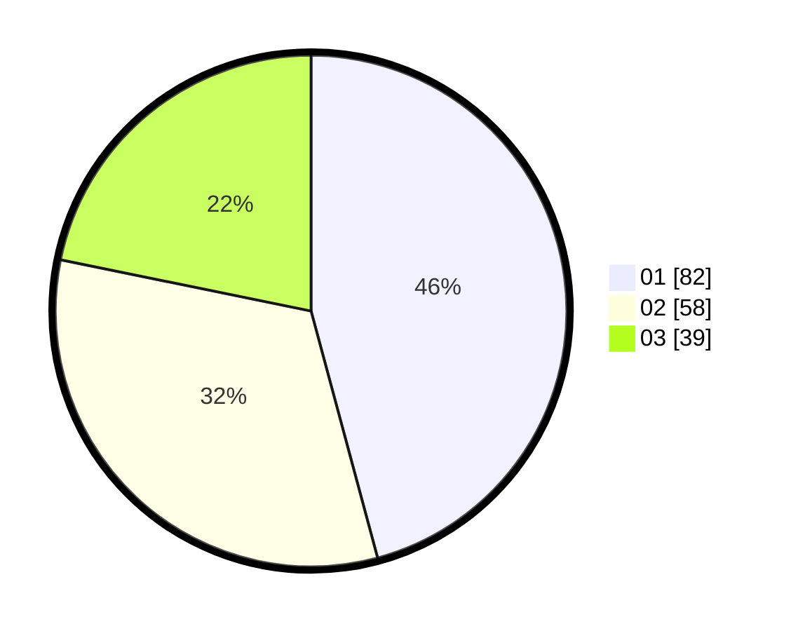

# Hasil

Hasil perolehan suara paslon dapat dilihat pada file paslon-01.txt, paslon-02.txt, dan paslon-03.txt.

Jika tidak ada, artinya data tersebut belum ada pada SIREKAP.

## Perolehan Suara

 * Paslon 01: **82**.
 * Paslon 02: **58**.
 * Paslon 03: **39**.

## Foto C Plano

https://sirekap-obj-formc.kpu.go.id/81b4/pemilu/ppwp/31/73/08/10/04/3173081004091-20240214-220333--3bc85c6b-5ee3-402d-bad0-62d271df63f8.jpg

https://sirekap-obj-formc.kpu.go.id/81b4/pemilu/ppwp/31/73/08/10/04/3173081004091-20240215-012239--9aa05853-a699-430f-abd4-093fda41f3c3.jpg

https://sirekap-obj-formc.kpu.go.id/81b4/pemilu/ppwp/31/73/08/10/04/3173081004091-20240216-133907--468b5376-f286-49ad-bc51-2f87c8ffaa39.jpg

## DATA PEMILIH TETAP

Jumlah pemilih dalam DPT: **218**.
 * L: **113**.
 * P: **105**.

## DATA PENGGUNA HAK PILIH

Jumlah pengguna hak pilih dalam DPT: **177**.
 * L: **94**.
 * P: **83**.

Jumlah pengguna hak pilih dalam DPTb: **1**.
 * L: **1**.
 * P: **0**.

Jumlah pengguna hak pilih dalam DPK: **2**.
 * L: **1**.
 * P: **1**.

Jumlah pengguna hak pilih: **180**.
 * L: **96**.
 * P: **84**.

## JUMLAH SUARA SAH DAN TIDAK SAH

JUMLAH SELURUH SUARA SAH: **179**.

JUMLAH SUARA TIDAK SAH: **1**.

JUMLAH SELURUH SUARA SAH DAN SUARA TIDAK SAH: **180**.
