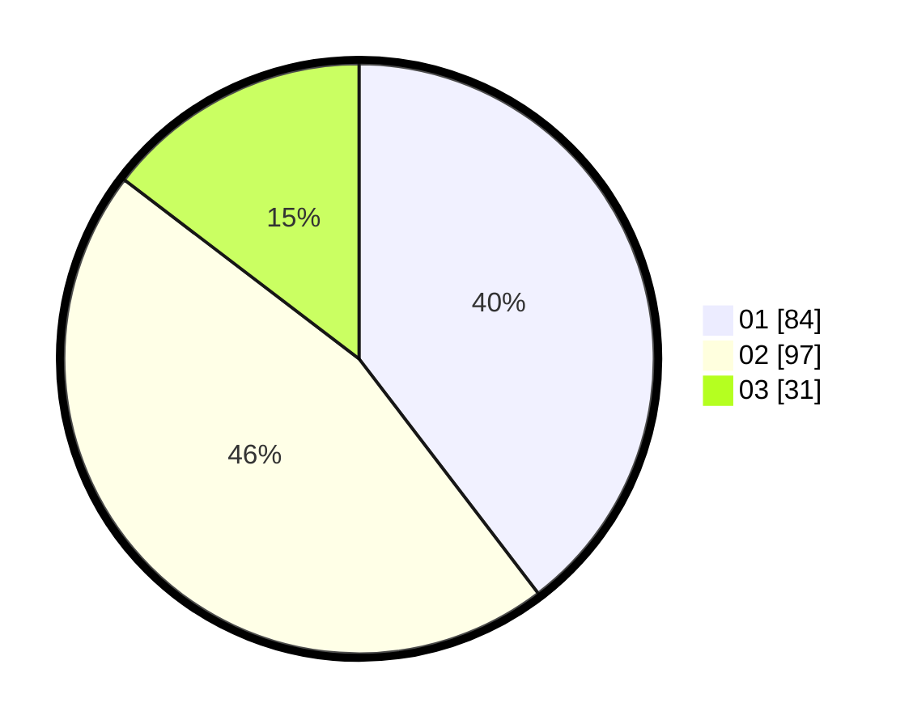

# Hasil

Hasil perolehan suara paslon dapat dilihat pada file paslon-01.txt, paslon-02.txt, dan paslon-03.txt.

Jika tidak ada, artinya data tersebut belum ada pada SIREKAP.

## Perolehan Suara

 * Paslon 01: **84**.
 * Paslon 02: **97**.
 * Paslon 03: **31**.

## Foto C Plano

https://sirekap-obj-formc.kpu.go.id/eb37/pemilu/ppwp/31/73/08/10/04/3173081004092-20240214-195227--a3433c25-ac5e-47f4-84a2-f62507703f52.jpg

https://sirekap-obj-formc.kpu.go.id/eb37/pemilu/ppwp/31/73/08/10/04/3173081004092-20240214-155703--43818169-4867-441e-8ef2-d570aa4ed308.jpg

https://sirekap-obj-formc.kpu.go.id/eb37/pemilu/ppwp/31/73/08/10/04/3173081004092-20240214-195245--8cc3da0e-0926-411c-a2d3-d3ad8fbdc3f1.jpg

## DATA PEMILIH TETAP

Jumlah pemilih dalam DPT: **263**.
 * L: **129**.
 * P: **134**.

## DATA PENGGUNA HAK PILIH

Jumlah pengguna hak pilih dalam DPT: **209**.
 * L: **99**.
 * P: **110**.

Jumlah pengguna hak pilih dalam DPTb: **4**.
 * L: **3**.
 * P: **1**.

Jumlah pengguna hak pilih dalam DPK: **1**.
 * L: **1**.
 * P: **0**.

Jumlah pengguna hak pilih: **214**.
 * L: **103**.
 * P: **111**.

## JUMLAH SUARA SAH DAN TIDAK SAH

JUMLAH SELURUH SUARA SAH: **212**.

JUMLAH SUARA TIDAK SAH: **2**.

JUMLAH SELURUH SUARA SAH DAN SUARA TIDAK SAH: **214**.
