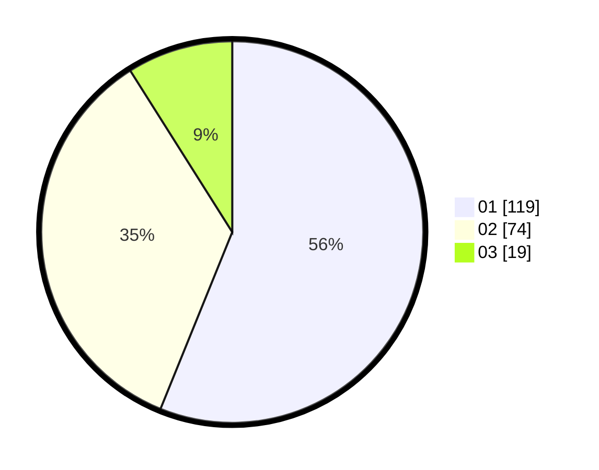

# Hasil

Hasil perolehan suara paslon dapat dilihat pada file paslon-01.txt, paslon-02.txt, dan paslon-03.txt.

Jika tidak ada, artinya data tersebut belum ada pada SIREKAP.

## Perolehan Suara

 * Paslon 01: **119**.
 * Paslon 02: **74**.
 * Paslon 03: **19**.

## Foto C Plano

https://sirekap-obj-formc.kpu.go.id/c66e/pemilu/ppwp/31/73/08/10/04/3173081004095-20240214-155704--79e99aa9-4ad3-4979-8b67-3e571a842afd.jpg

https://sirekap-obj-formc.kpu.go.id/c66e/pemilu/ppwp/31/73/08/10/04/3173081004095-20240214-155855--54d9632b-98d2-4298-8dda-de82e44bf985.jpg

https://sirekap-obj-formc.kpu.go.id/c66e/pemilu/ppwp/31/73/08/10/04/3173081004095-20240214-160120--090f5ace-13df-4d61-a846-fafda0080bf1.jpg

## DATA PEMILIH TETAP

Jumlah pemilih dalam DPT: **297**.
 * L: **131**.
 * P: **166**.

## DATA PENGGUNA HAK PILIH

Jumlah pengguna hak pilih dalam DPT: **213**.
 * L: **87**.
 * P: **126**.

Jumlah pengguna hak pilih dalam DPTb: **2**.
 * L: **1**.
 * P: **1**.

Jumlah pengguna hak pilih dalam DPK: **2**.
 * L: **1**.
 * P: **1**.

Jumlah pengguna hak pilih: **217**.
 * L: **89**.
 * P: **128**.

## JUMLAH SUARA SAH DAN TIDAK SAH

JUMLAH SELURUH SUARA SAH: **212**.

JUMLAH SUARA TIDAK SAH: **5**.

JUMLAH SELURUH SUARA SAH DAN SUARA TIDAK SAH: **217**.
