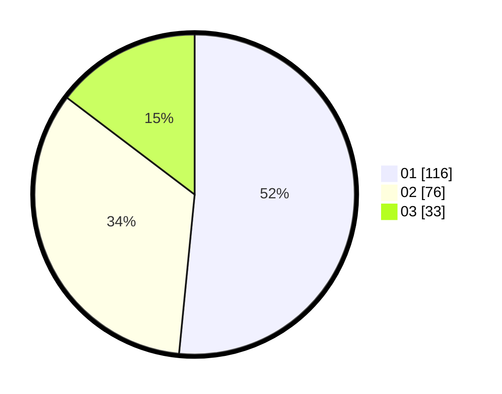

# Hasil

Hasil perolehan suara paslon dapat dilihat pada file paslon-01.txt, paslon-02.txt, dan paslon-03.txt.

Jika tidak ada, artinya data tersebut belum ada pada SIREKAP.

## Perolehan Suara

 * Paslon 01: **116**.
 * Paslon 02: **76**.
 * Paslon 03: **33**.

## Foto C Plano

https://sirekap-obj-formc.kpu.go.id/7a04/pemilu/ppwp/31/73/08/10/04/3173081004097-20240217-161924--7d959a12-2d4e-46a6-9801-f39c06b8a6e9.jpg

https://sirekap-obj-formc.kpu.go.id/7a04/pemilu/ppwp/31/73/08/10/04/3173081004097-20240217-162121--44650d9f-2dbd-42eb-868c-041df7be8ff9.jpg

https://sirekap-obj-formc.kpu.go.id/7a04/pemilu/ppwp/31/73/08/10/04/3173081004097-20240214-215649--021fff4e-0859-4bf9-8a7f-765fd2bf636d.jpg
