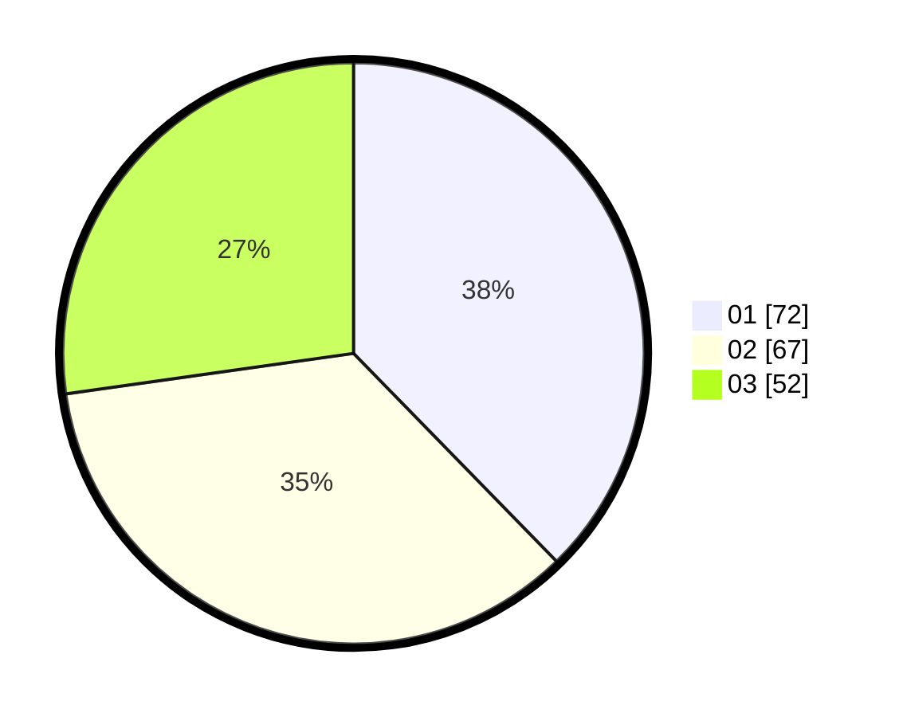

# Hasil

Hasil perolehan suara paslon dapat dilihat pada file paslon-01.txt, paslon-02.txt, dan paslon-03.txt.

Jika tidak ada, artinya data tersebut belum ada pada SIREKAP.

## Perolehan Suara

 * Paslon 01: **72**.
 * Paslon 02: **67**.
 * Paslon 03: **52**.

## Foto C Plano

https://sirekap-obj-formc.kpu.go.id/ba3f/pemilu/ppwp/31/73/08/10/04/3173081004098-20240215-015415--cd35cba3-5cd8-42ba-b1c2-1ba5bbf64892.jpg

https://sirekap-obj-formc.kpu.go.id/ba3f/pemilu/ppwp/31/73/08/10/04/3173081004098-20240215-015537--a08e0789-d3e1-4482-9df8-9ace4a8f3693.jpg
