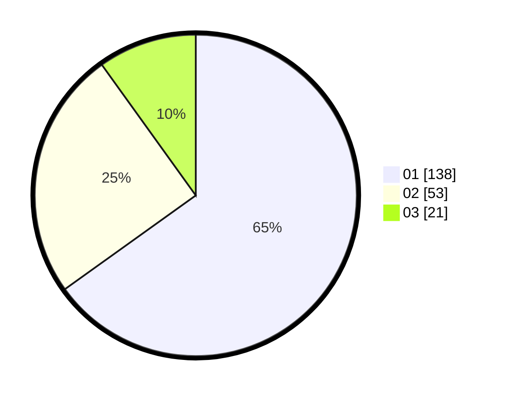

# Hasil

Hasil perolehan suara paslon dapat dilihat pada file paslon-01.txt, paslon-02.txt, dan paslon-03.txt.

Jika tidak ada, artinya data tersebut belum ada pada SIREKAP.

## Perolehan Suara

 * Paslon 01: **138**.
 * Paslon 02: **53**.
 * Paslon 03: **21**.

## Foto C Plano

https://sirekap-obj-formc.kpu.go.id/7210/pemilu/ppwp/31/73/08/10/04/3173081004101-20240216-165245--58417cca-036d-47b7-8cbe-d08d51a45d66.jpg

https://sirekap-obj-formc.kpu.go.id/7210/pemilu/ppwp/31/73/08/10/04/3173081004101-20240215-020301--57434313-7c8c-478b-9c69-35bfab7baad3.jpg

https://sirekap-obj-formc.kpu.go.id/7210/pemilu/ppwp/31/73/08/10/04/3173081004101-20240215-020351--035221a0-8a06-4ee0-8a04-e747782029b3.jpg
