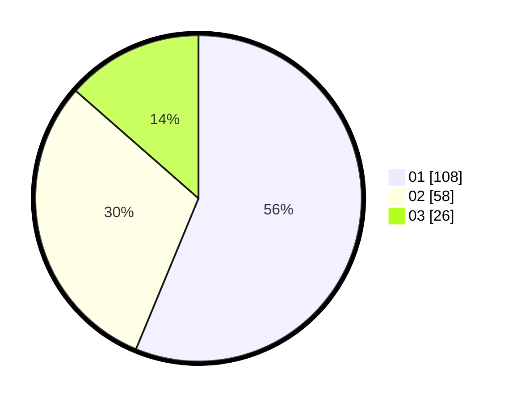

# Hasil

Hasil perolehan suara paslon dapat dilihat pada file paslon-01.txt, paslon-02.txt, dan paslon-03.txt.

Jika tidak ada, artinya data tersebut belum ada pada SIREKAP.

## Perolehan Suara

 * Paslon 01: **108**.
 * Paslon 02: **58**.
 * Paslon 03: **26**.

## Foto C Plano

https://sirekap-obj-formc.kpu.go.id/54d4/pemilu/ppwp/31/73/08/10/04/3173081004102-20240214-212406--12ec8a97-f09d-4cad-9580-e82476490671.jpg

https://sirekap-obj-formc.kpu.go.id/54d4/pemilu/ppwp/31/73/08/10/04/3173081004102-20240214-211706--d8af99ef-259d-4669-a1da-2d97912c97a7.jpg

https://sirekap-obj-formc.kpu.go.id/54d4/pemilu/ppwp/31/73/08/10/04/3173081004102-20240214-212038--ecb51433-67eb-4f8d-ba09-ee687fc2d190.jpg
