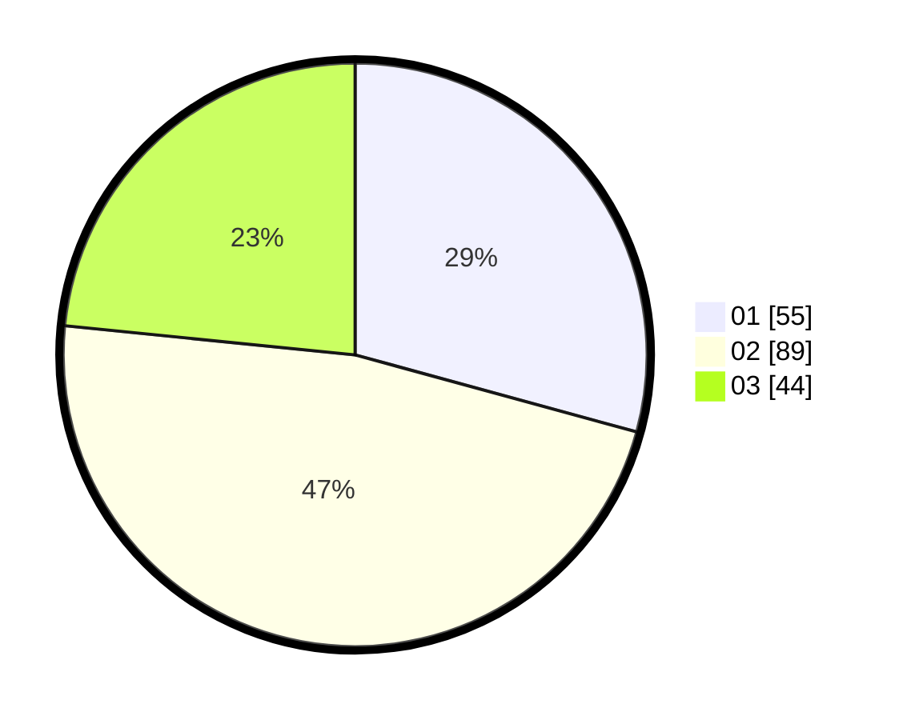

# Hasil

Hasil perolehan suara paslon dapat dilihat pada file paslon-01.txt, paslon-02.txt, dan paslon-03.txt.

Jika tidak ada, artinya data tersebut belum ada pada SIREKAP.

## Perolehan Suara

 * Paslon 01: **55**.
 * Paslon 02: **89**.
 * Paslon 03: **44**.

## Foto C Plano

https://sirekap-obj-formc.kpu.go.id/5952/pemilu/ppwp/31/73/08/10/04/3173081004110-20240216-111616--34254313-f4ba-4a14-992d-31a610b9146c.jpg

https://sirekap-obj-formc.kpu.go.id/5952/pemilu/ppwp/31/73/08/10/04/3173081004110-20240216-111618--7e1c756b-11b8-4611-96d9-cbb4222f8f5c.jpg

https://sirekap-obj-formc.kpu.go.id/5952/pemilu/ppwp/31/73/08/10/04/3173081004110-20240216-111617--8fd98b2c-6afe-420d-9f54-3eba289bc1b2.jpg

## DATA PEMILIH TETAP

Jumlah pemilih dalam DPT: **266**.
 * L: **130**.
 * P: **136**.

## DATA PENGGUNA HAK PILIH

Jumlah pengguna hak pilih dalam DPT: **188**.
 * L: **92**.
 * P: **96**.

Jumlah pengguna hak pilih dalam DPTb: **0**.
 * L: **0**.
 * P: **0**.

Jumlah pengguna hak pilih dalam DPK: **1**.
 * L: **0**.
 * P: **1**.

Jumlah pengguna hak pilih: **189**.
 * L: **92**.
 * P: **97**.

## JUMLAH SUARA SAH DAN TIDAK SAH

JUMLAH SELURUH SUARA SAH: **188**.

JUMLAH SUARA TIDAK SAH: **1**.

JUMLAH SELURUH SUARA SAH DAN SUARA TIDAK SAH: **189**.
