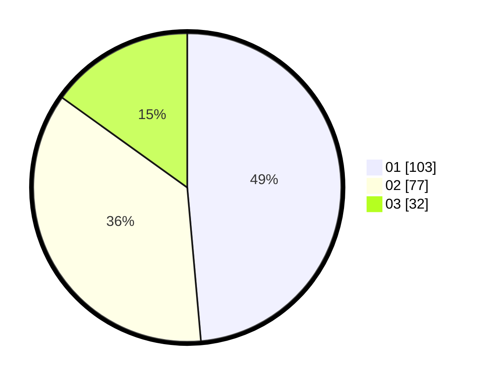

# Hasil

Hasil perolehan suara paslon dapat dilihat pada file paslon-01.txt, paslon-02.txt, dan paslon-03.txt.

Jika tidak ada, artinya data tersebut belum ada pada SIREKAP.

## Perolehan Suara

 * Paslon 01: **103**.
 * Paslon 02: **77**.
 * Paslon 03: **32**.

## Foto C Plano

https://sirekap-obj-formc.kpu.go.id/7331/pemilu/ppwp/31/73/08/10/04/3173081004113-20240214-210017--9ba65c47-f7a3-40e4-80a1-8a48a824ae5b.jpg

https://sirekap-obj-formc.kpu.go.id/7331/pemilu/ppwp/31/73/08/10/04/3173081004113-20240214-205819--dc270fb3-cf25-478c-b520-bcbea75d9ba2.jpg

https://sirekap-obj-formc.kpu.go.id/7331/pemilu/ppwp/31/73/08/10/04/3173081004113-20240214-225510--90ecc841-a40d-4bed-b932-4e6527944b1a.jpg

## DATA PEMILIH TETAP

Jumlah pemilih dalam DPT: **269**.
 * L: **129**.
 * P: **140**.

## DATA PENGGUNA HAK PILIH

Jumlah pengguna hak pilih dalam DPT: **205**.
 * L: **96**.
 * P: **109**.

Jumlah pengguna hak pilih dalam DPTb: **6**.
 * L: **4**.
 * P: **2**.

Jumlah pengguna hak pilih dalam DPK: **4**.
 * L: **0**.
 * P: **4**.

Jumlah pengguna hak pilih: **215**.
 * L: **100**.
 * P: **115**.

## JUMLAH SUARA SAH DAN TIDAK SAH

JUMLAH SELURUH SUARA SAH: **212**.

JUMLAH SUARA TIDAK SAH: **3**.

JUMLAH SELURUH SUARA SAH DAN SUARA TIDAK SAH: **215**.
