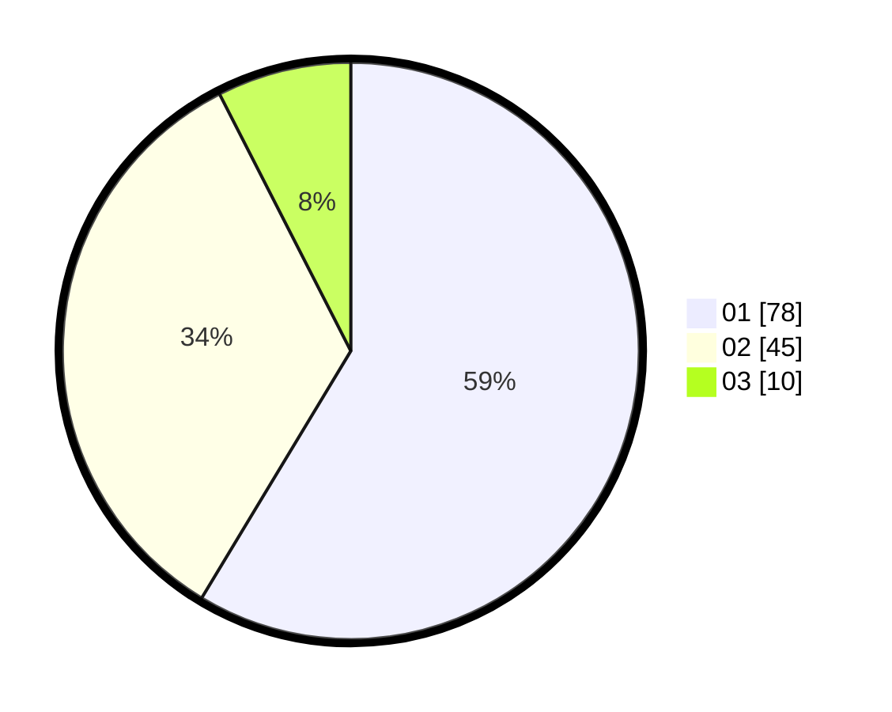

# Hasil

Hasil perolehan suara paslon dapat dilihat pada file paslon-01.txt, paslon-02.txt, dan paslon-03.txt.

Jika tidak ada, artinya data tersebut belum ada pada SIREKAP.

## Perolehan Suara

 * Paslon 01: **78**.
 * Paslon 02: **45**.
 * Paslon 03: **10**.

## Foto C Plano

https://sirekap-obj-formc.kpu.go.id/1980/pemilu/ppwp/31/73/08/10/04/3173081004117-20240216-134451--af458223-74dc-4468-97ab-c11ee2afd90b.jpg

https://sirekap-obj-formc.kpu.go.id/1980/pemilu/ppwp/31/73/08/10/04/3173081004117-20240216-134453--a2b51d42-f92f-4bac-9fc4-be1cd6904733.jpg

https://sirekap-obj-formc.kpu.go.id/1980/pemilu/ppwp/31/73/08/10/04/3173081004117-20240216-134452--7cbfa241-b678-4e32-83eb-7a6a5e891747.jpg

## DATA PEMILIH TETAP

Jumlah pemilih dalam DPT: **175**.
 * L: **88**.
 * P: **87**.

## DATA PENGGUNA HAK PILIH

Jumlah pengguna hak pilih dalam DPT: **134**.
 * L: **64**.
 * P: **70**.

Jumlah pengguna hak pilih dalam DPTb: **1**.
 * L: **0**.
 * P: **1**.

Jumlah pengguna hak pilih dalam DPK: **2**.
 * L: **1**.
 * P: **1**.

Jumlah pengguna hak pilih: **137**.
 * L: **65**.
 * P: **72**.

## JUMLAH SUARA SAH DAN TIDAK SAH

JUMLAH SELURUH SUARA SAH: **133**.

JUMLAH SUARA TIDAK SAH: **4**.

JUMLAH SELURUH SUARA SAH DAN SUARA TIDAK SAH: **137**.
