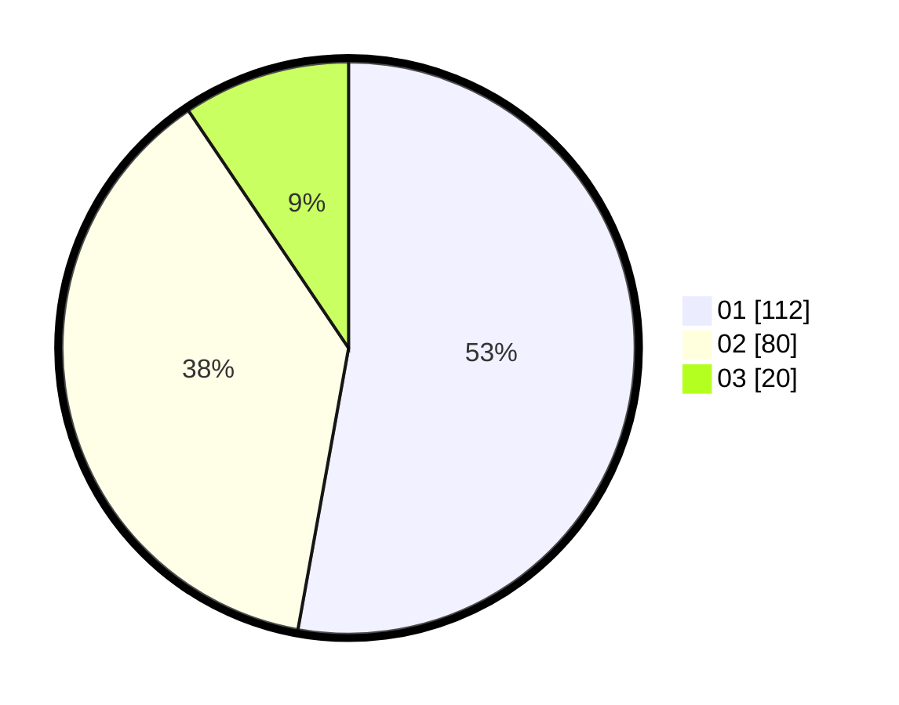

# Hasil

Hasil perolehan suara paslon dapat dilihat pada file paslon-01.txt, paslon-02.txt, dan paslon-03.txt.

Jika tidak ada, artinya data tersebut belum ada pada SIREKAP.

## Perolehan Suara

 * Paslon 01: **112**.
 * Paslon 02: **80**.
 * Paslon 03: **20**.

## Foto C Plano

https://sirekap-obj-formc.kpu.go.id/3357/pemilu/ppwp/31/73/08/10/04/3173081004119-20240214-231511--27e15836-0477-440d-9fd9-b067a966c9f3.jpg

https://sirekap-obj-formc.kpu.go.id/3357/pemilu/ppwp/31/73/08/10/04/3173081004119-20240214-231553--230cbdd4-c3da-44fd-8521-8c4709a817b5.jpg

https://sirekap-obj-formc.kpu.go.id/3357/pemilu/ppwp/31/73/08/10/04/3173081004119-20240214-231637--63b5c6c0-2507-422f-aefc-5ced8d182f49.jpg
