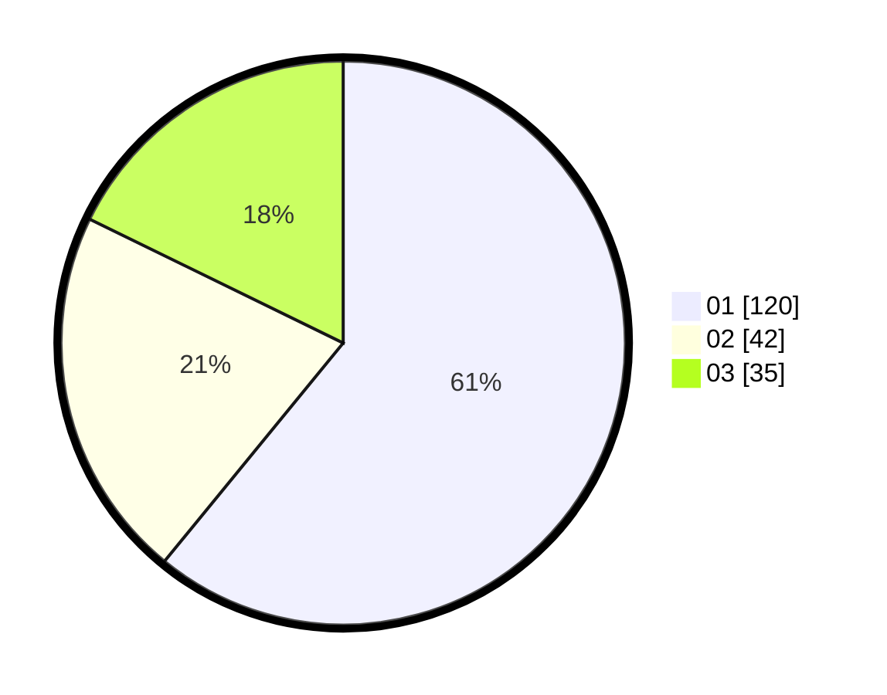

# Hasil

Hasil perolehan suara paslon dapat dilihat pada file paslon-01.txt, paslon-02.txt, dan paslon-03.txt.

Jika tidak ada, artinya data tersebut belum ada pada SIREKAP.

## Perolehan Suara

 * Paslon 01: **120**.
 * Paslon 02: **42**.
 * Paslon 03: **35**.

## Foto C Plano

https://sirekap-obj-formc.kpu.go.id/c634/pemilu/ppwp/31/73/08/10/04/3173081004122-20240215-010006--850c19bb-a568-4986-9539-72c7f17eddfe.jpg

https://sirekap-obj-formc.kpu.go.id/c634/pemilu/ppwp/31/73/08/10/04/3173081004122-20240215-010130--36d9192b-4d8d-4bcf-8bac-b1af4a0487ab.jpg

https://sirekap-obj-formc.kpu.go.id/c634/pemilu/ppwp/31/73/08/10/04/3173081004122-20240215-010222--261fb50d-4177-4db6-b938-06a4bb0bef8c.jpg
