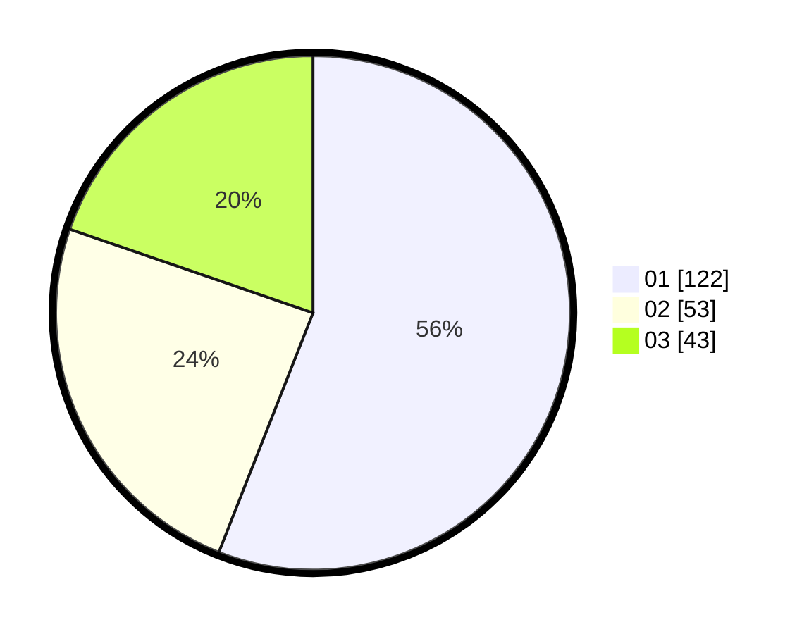

# Hasil

Hasil perolehan suara paslon dapat dilihat pada file paslon-01.txt, paslon-02.txt, dan paslon-03.txt.

Jika tidak ada, artinya data tersebut belum ada pada SIREKAP.

## Perolehan Suara

 * Paslon 01: **122**.
 * Paslon 02: **53**.
 * Paslon 03: **43**.

## Foto C Plano

https://sirekap-obj-formc.kpu.go.id/b1b0/pemilu/ppwp/31/73/08/10/04/3173081004127-20240214-160113--e14979d0-2609-411b-a5a7-1dc044014a5a.jpg

https://sirekap-obj-formc.kpu.go.id/b1b0/pemilu/ppwp/31/73/08/10/04/3173081004127-20240215-003132--3972e32e-8f10-47bd-9ea1-69cd50dfa603.jpg

https://sirekap-obj-formc.kpu.go.id/b1b0/pemilu/ppwp/31/73/08/10/04/3173081004127-20240214-155815--bb3f9428-70fe-44ee-a529-04438f1dfbd0.jpg

## DATA PEMILIH TETAP

Jumlah pemilih dalam DPT: **264**.
 * L: **128**.
 * P: **136**.

## DATA PENGGUNA HAK PILIH

Jumlah pengguna hak pilih dalam DPT: **215**.
 * L: **105**.
 * P: **110**.

Jumlah pengguna hak pilih dalam DPTb: **3**.
 * L: **1**.
 * P: **2**.

Jumlah pengguna hak pilih dalam DPK: **1**.
 * L: **0**.
 * P: **1**.

Jumlah pengguna hak pilih: **219**.
 * L: **106**.
 * P: **113**.

## JUMLAH SUARA SAH DAN TIDAK SAH

JUMLAH SELURUH SUARA SAH: **218**.

JUMLAH SUARA TIDAK SAH: **1**.

JUMLAH SELURUH SUARA SAH DAN SUARA TIDAK SAH: **219**.
