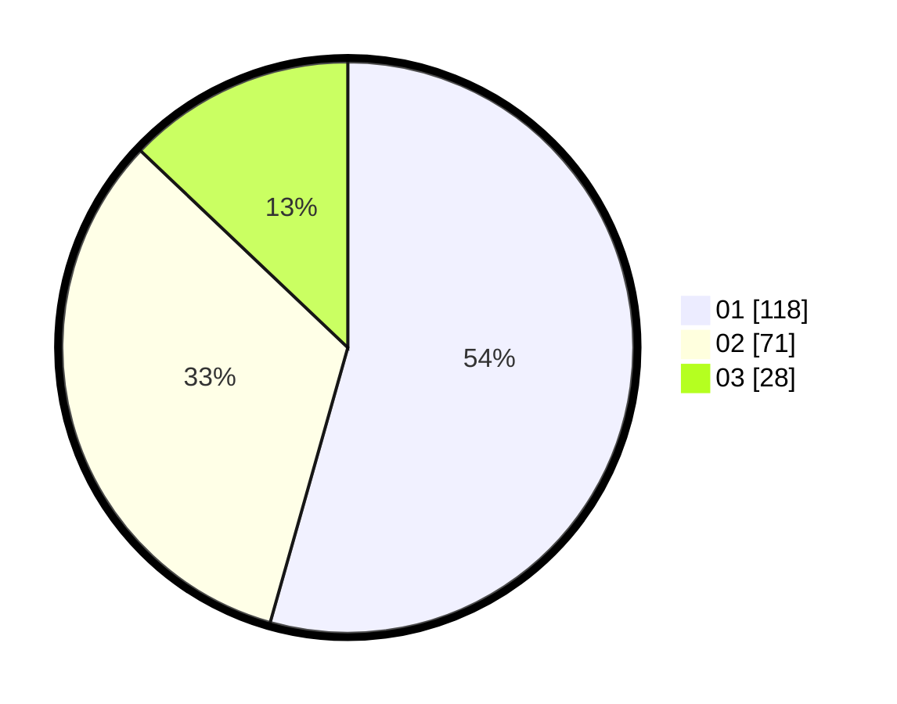

# Hasil

Hasil perolehan suara paslon dapat dilihat pada file paslon-01.txt, paslon-02.txt, dan paslon-03.txt.

Jika tidak ada, artinya data tersebut belum ada pada SIREKAP.

## Perolehan Suara

 * Paslon 01: **118**.
 * Paslon 02: **71**.
 * Paslon 03: **28**.

## Foto C Plano

https://sirekap-obj-formc.kpu.go.id/d0a2/pemilu/ppwp/31/73/08/10/04/3173081004129-20240215-004910--fdb254c0-3648-4bf0-b076-f3c038067855.jpg

https://sirekap-obj-formc.kpu.go.id/d0a2/pemilu/ppwp/31/73/08/10/04/3173081004129-20240214-203814--4aa3ab78-0239-44cb-a014-78a5c3133615.jpg

https://sirekap-obj-formc.kpu.go.id/d0a2/pemilu/ppwp/31/73/08/10/04/3173081004129-20240215-005148--b52daedf-d412-45da-b9b7-f04dc00aaf26.jpg
