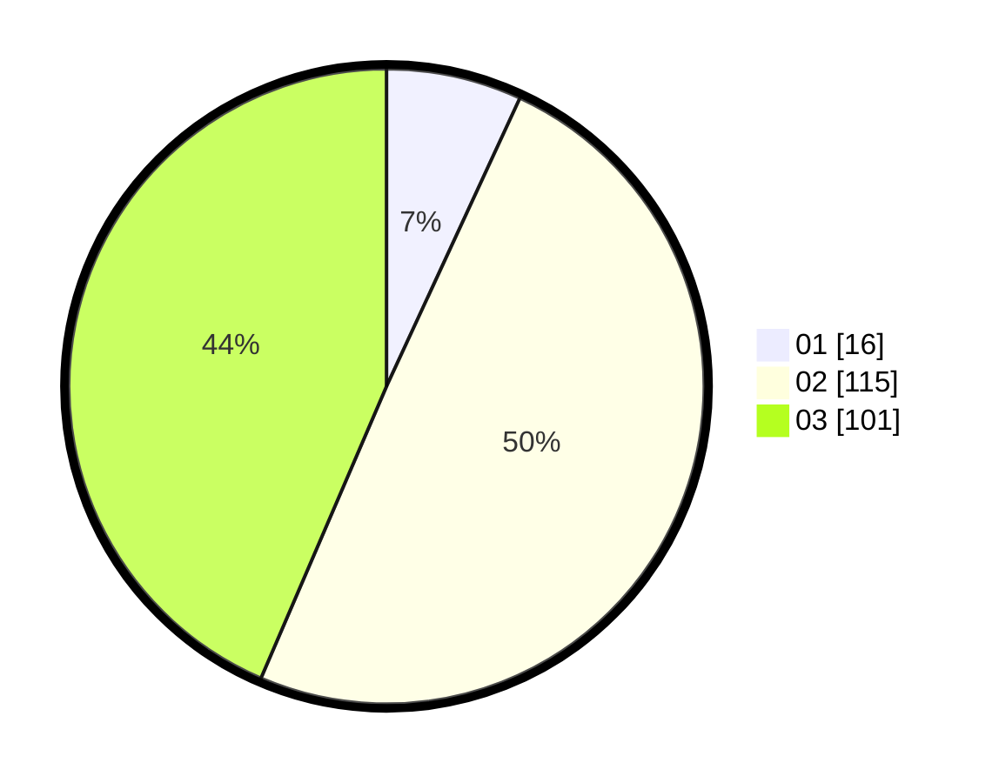

# Hasil

Hasil perolehan suara paslon dapat dilihat pada file paslon-01.txt, paslon-02.txt, dan paslon-03.txt.

Jika tidak ada, artinya data tersebut belum ada pada SIREKAP.

## Perolehan Suara

 * Paslon 01: **16**.
 * Paslon 02: **115**.
 * Paslon 03: **101**.

## Foto C Plano

https://sirekap-obj-formc.kpu.go.id/29be/pemilu/ppwp/31/73/08/10/04/3173081004130-20240214-190342--0b7e2b93-1b27-4ab1-94ce-ae5d0cbef1ef.jpg

https://sirekap-obj-formc.kpu.go.id/29be/pemilu/ppwp/31/73/08/10/04/3173081004130-20240214-191017--b87d338d-41dc-476a-b972-8fe1ceb9100f.jpg

https://sirekap-obj-formc.kpu.go.id/29be/pemilu/ppwp/31/73/08/10/04/3173081004130-20240214-192212--4904ccc2-03f4-4237-9085-18efdbf68f8e.jpg

## DATA PEMILIH TETAP

Jumlah pemilih dalam DPT: **279**.
 * L: **133**.
 * P: **146**.

## DATA PENGGUNA HAK PILIH

Jumlah pengguna hak pilih dalam DPT: **212**.
 * L: **103**.
 * P: **109**.

Jumlah pengguna hak pilih dalam DPTb: **17**.
 * L: **6**.
 * P: **11**.

Jumlah pengguna hak pilih dalam DPK: **7**.
 * L: **4**.
 * P: **3**.

Jumlah pengguna hak pilih: **236**.
 * L: **113**.
 * P: **123**.

## JUMLAH SUARA SAH DAN TIDAK SAH

JUMLAH SELURUH SUARA SAH: **232**.

JUMLAH SUARA TIDAK SAH: **4**.

JUMLAH SELURUH SUARA SAH DAN SUARA TIDAK SAH: **236**.
