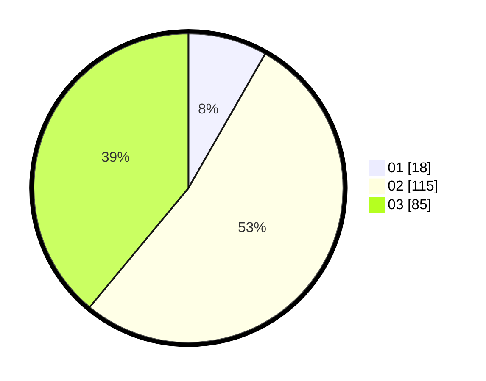

# Hasil

Hasil perolehan suara paslon dapat dilihat pada file paslon-01.txt, paslon-02.txt, dan paslon-03.txt.

Jika tidak ada, artinya data tersebut belum ada pada SIREKAP.

## Perolehan Suara

 * Paslon 01: **18**.
 * Paslon 02: **115**.
 * Paslon 03: **85**.

## Foto C Plano

https://sirekap-obj-formc.kpu.go.id/baa6/pemilu/ppwp/31/73/08/10/04/3173081004131-20240214-195859--df62426c-c4b8-4ada-af4b-9dd944fc23f8.jpg

https://sirekap-obj-formc.kpu.go.id/baa6/pemilu/ppwp/31/73/08/10/04/3173081004131-20240214-141729--0cc4a670-40f6-4596-81da-605df1919b19.jpg

https://sirekap-obj-formc.kpu.go.id/baa6/pemilu/ppwp/31/73/08/10/04/3173081004131-20240214-195903--37a8b249-81ee-4e72-931d-8ec0de93f599.jpg

## DATA PEMILIH TETAP

Jumlah pemilih dalam DPT: **266**.
 * L: **125**.
 * P: **141**.

## DATA PENGGUNA HAK PILIH

Jumlah pengguna hak pilih dalam DPT: **201**.
 * L: **95**.
 * P: **106**.

Jumlah pengguna hak pilih dalam DPTb: **15**.
 * L: **2**.
 * P: **13**.

Jumlah pengguna hak pilih dalam DPK: **4**.
 * L: **2**.
 * P: **2**.

Jumlah pengguna hak pilih: **220**.
 * L: **99**.
 * P: **121**.

## JUMLAH SUARA SAH DAN TIDAK SAH

JUMLAH SELURUH SUARA SAH: **218**.

JUMLAH SUARA TIDAK SAH: **2**.

JUMLAH SELURUH SUARA SAH DAN SUARA TIDAK SAH: **220**.
